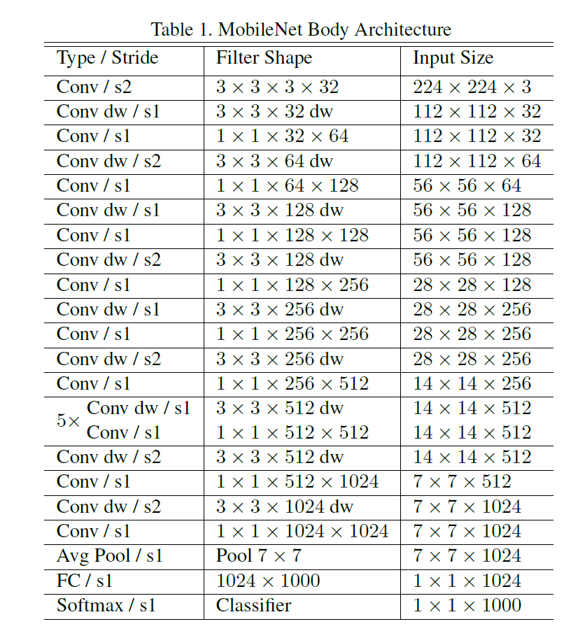
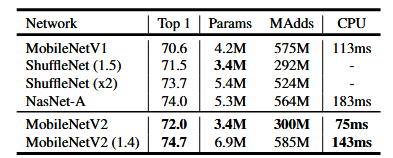

#### Transfer Learning Modelle

Für die Objekterkennung wurde sich in diesem Projekt für die Bildklassifikation entschieden. Edge Impulse bietet hierfür die Möglichkeit des [Transfer Learnings](https://docs.edgeimpulse.com/docs/edge-impulse-studio/learning-blocks/transfer-learning-images). Dabei wird ein bereits vortrainiertes Modell verwendet und auf einen neuen, aber ähnlichen Anwendungszweck angepasst.

Ein großer Vorteil des Transfer Learnings ist, dass dadurch weniger Trainingsdaten und kürzere Trainingszeiten benötigt werden. Das Prinzip beruht darauf, dass ein bestehender Feature-Extractor (Merkmalserkenner) beibehalten wird, während nur die oberen Schichten des neuronalen Netzes – also die Klassifizierungs-„Köpfe“ – durch neue ersetzt und auf die gewünschten Klassen trainiert werden. Dies geschieht in den oberen Layern des Netzwerks (siehe auch [Transfer Learning](https://datascientest.com/de/transfer-learning)).

Edge Impulse bietet hierfür bereits vorbereitete Modelle an. Im Rahmen dieses Projekts wurden die oberen drei Layer des Netzes entfernt:


```Python
last_layer_index = -3
model.add(Model(inputs=base_model.inputs, outputs=base_model.layers[last_layer_index].output))****
```

Stattdessen wird ein eigener Klassifikationskopf erstellt:

```Python
model.add(Reshape((-1, model.layers[-1].output.shape[3])))
model.add(Dense(8, activation='relu'))
model.add(Dropout(0.1))
model.add(Flatten())
model.add(Dense(classes, activation='softmax'))
```

Zusätzlich wird nach dem Training des neuen Klassifikationskopfs auch der Feature-Extraktor noch einmal optimiert.

```Python
model = ei_tensorflow.training.load_best_model(BEST_MODEL_PATH)
# Allow the entire base model to be trained
model.trainable = True
# Freeze all the layers before the 'fine_tune_from' layer
for layer in model.layers[:fine_tune_from]:
    layer.trainable = False
``` 

Bei dem oben stehenden Code handelt es sich um Ausschnitte aus dem Code, den Edge Impulse im [Expertenmodus](https://docs.edgeimpulse.com/docs/edge-impulse-studio/learning-blocks/transfer-learning-images#expert-mode) anzeigt. Er bezieht sich auf das MobileNetV2-Modell – beim V1-Modell sieht der Aufbau anders aus. 

Theoretisch besteht hier auch die Möglichkeit, das Modell weiter zu optimieren. Dies wurde im Projekt jedoch nicht genutzt, da die Auswahl an verschiedenen Modellen zunächst ausreichend war. Für erfahrene Nutzer bestehen hier sicherlich weitere Anpassungsmöglichkeiten.

##### Überblick über verschiedene Modelle

Im folgenden Abschnitt sollen die in Edge Impulse verfügbaren Modelle für das Transfer Learning mit Bildern näher betrachtet werden. Edge Impulse bietet aktuell drei [Architekturen](https://docs.edgeimpulse.com/docs/edge-impulse-studio/learning-blocks/transfer-learning-images#expert-mode) an. Jedes dieser Modelle ist mit unterschiedlichen Alpha-Werten verfügbar. Dieser Wert, auch bekannt als [Width Multiplier](https://viso.ai/deep-learning/mobilenet-efficient-deep-learning-for-mobile-vision/#mobilenet-architecture), beeinflusst die Anzahl der Kanäle pro Layer. Dadurch lässt sich das Modell verkleinern und beschleunigen – allerdings mit Auswirkungen auf die Genauigkeit. Mehr dazu im Abschnitt [Ergebnisse](#ergebnisse).

Zur Auswahl stehen die Modelle [MobileNetV1](https://docs.edgeimpulse.com/docs/edge-impulse-studio/learning-blocks/transfer-learning-images#mobilenetv1-1), [MobileNetV2](https://docs.edgeimpulse.com/docs/edge-impulse-studio/learning-blocks/transfer-learning-images#mobilenetv2-1) und [EfficientNet](https://docs.edgeimpulse.com/docs/edge-impulse-studio/learning-blocks/transfer-learning-images#efficientnet-1). In diesem Projekt wurden jedoch nur die beiden MobileNet-Modelle näher betrachtet, da die EfficientNet-Modelle mindestens 4 MB RAM benötigen und somit zu groß für den [Arduino Nicla Vision](#nicla-vision) sind.

Die MobileNetV1-Modelle wurden 2017 von einem Forscherteam bei Google [veröffentlicht](https://arxiv.org/abs/1704.04861). Es handelt sich dabei um eine Modellklasse, die speziell für mobile und eingebettete Anwendungen im Bereich der visuellen Erkennung entwickelt wurde. Ziel war es, die Modellgröße drastisch zu reduzieren – bei gleichzeitig guter Leistung im Vergleich zu anderen Modellen [vgl. MobileNet 4](https://arxiv.org/pdf/1704.04861).

Das Modell nutzt sogenannte [Depthwise Separable Convolutions](https://viso.ai/deep-learning/mobilenet-efficient-deep-learning-for-mobile-vision/#depthwise-convolution-and-pointwise-convolution) anstelle einer klassischen Faltung über alle Kanäle gleichzeitig. Dieser Prozess wird dabei in zwei Schritte aufgeteilt [vgl. Depthwise Convolution and Pointwise Convolution](https://viso.ai/deep-learning/mobilenet-efficient-deep-learning-for-mobile-vision/#depthwise-convolution-and-pointwise-convolution): Zunächst wird für jeden Kanal ein einzelner Filter verwendet (Depthwise Convolution). Anschließend werden die Outputs mithilfe eines 1x1-Filters kombiniert, wobei jeder Pixel mit allen Kanälen verarbeitet wird (Pointwise Convolution). So entsteht eine neue Feature Map, vergleichbar mit einer klassischen Faltung – jedoch in zwei getrennten Schritten [vgl. Depthwise Separable Convolutions](https://viso.ai/deep-learning/mobilenet-efficient-deep-learning-for-mobile-vision/#depthwise-separable-convolutions).

  
[source](https://viso.ai/wp-content/uploads/2024/04/depthwise.jpg)

Durch diese Aufteilung in zwei Schritte reduziert sich der Rechenaufwand deutlich – bei vergleichbar guten Ergebnissen [vgl. MobileNets 3.1](https://arxiv.org/pdf/1704.04861). Eine ausführlichere Beschreibung findet sich im [Original-Paper](https://arxiv.org/pdf/1704.04861). Eine anschauliche visuelle Erklärung bietet zudem dieses [Video](https://www.youtube.com/watch?v=vVaRhZXovbw).


Die Architektur basiert zu großen Teilen auf **Depthwise Separable Convolutions**, wobei einige Layer – wie der erste – davon abweichen. Beim ersten Layer handelt es sich um eine **Full Convolution** [vgl. 3.2. Network Structure and Training](https://arxiv.org/pdf/1704.04861).  
In der nachfolgenden Grafik ist die Architektur dargestellt:  
  
[source](https://viso.ai/deep-learning/mobilenet-efficient-deep-learning-for-mobile-vision/#mobilenet-architecture)

Die Entwickler geben außerdem an, dass **95 % der Rechenzeit** für **1x1-Faltungen** aufgewendet werden. Diese machen zudem **75 % der Parameter** aus [vgl. 3.2 Network Structure and Training](https://arxiv.org/pdf/1704.04861).  
  
[source](https://arxiv.org/pdf/1704.04861)

MobileNet-Modelle sind zwar bereits sehr kompakt, für den Einsatz auf Edge Devices jedoch oft noch zu groß. Hierfür bietet MobileNet den bereits erwähnten **Width Multiplier (α)**. Dieser Wert reduziert die Anzahl der Ein- und Ausgabekanäle [vgl. 3.3. Width Multiplier: Thinner Models](https://arxiv.org/pdf/1704.04861). Wenn z. B. standardmäßig 32 Eingangskanäle vorhanden sind, reduziert ein α = 0.5 diese auf 16. Rechenaufwand und Parameteranzahl sinken etwa proportional zu **α²**.

Ein weiterer anpassbarer Wert ist der **Resolution Multiplier ρ**, der die Auflösung des Eingabebildes festlegt. Dadurch verringert sich auch die Auflösung aller folgenden Layer [vgl. 3.4. Resolution Multiplier: Reduced Representation](https://arxiv.org/pdf/1704.04861). Dies geschieht implizit durch die Auswahl der Input-Resolution. Der Standardwert beträgt 224. Weitere Auflösungen und ihre Auswirkungen auf die Modellgröße zeigt folgende Grafik:


**Edge Impulse** bietet derzeit drei Alpha-Werte an: **0.25**, **0.2** und **0.1**. Die Eingabeauflösung ist dabei fest auf **96×96** eingestellt. Beide Werte liegen unterhalb der im Paper beschriebenen Konfigurationen – bedingt durch die begrenzte Leistungsfähigkeit von Edge-Geräten. Der Vorteil: Der RAM-Bedarf liegt bei nur etwas über **100 KB**.

---

**MobileNetV2** wurde 2018 als Weiterentwicklung von V1 vorgestellt. Es basiert weiterhin auf **Depthwise Separable Convolutions**, nutzt jedoch zusätzlich sogenannte **Inverted Residual Blocks** mit **Bottleneck-Struktur**. Dadurch wird die Anzahl der Parameter sowie der Rechenaufwand weiter reduziert – bei vergleichbarer Genauigkeit [vgl. Keras](https://keras.io/api/applications/mobilenet/#mobilenetv2-function).

Ein Inverted Residual Block besteht aus drei Schritten:
1. **Expansion**: Die Kanalanzahl wird mittels einer 1×1-Convolution erhöht, um mehr Kapazität zur Merkmalsextraktion zu schaffen.
2. **Depthwise Convolution**: Eine 3×3-Depthwise Convolution filtert jeden Kanal separat mit geringem Rechenaufwand.
3. **Lineare Projektion (Bottleneck)**: Eine weitere 1×1-Convolution reduziert die Kanalanzahl – ohne Aktivierungsfunktion, um Informationsverlust zu vermeiden.

Nur wenn Eingabe- und Ausgabedimension identisch sind, wird eine **Residual-Verbindung** (Skip Connection) eingesetzt [vgl. 3. Preliminaries, Discussion and Intuition](https://arxiv.org/pdf/1801.04381).

Der Aufbau eines Inverted Residual Blocks:  
  
[source](https://miro.medium.com/v2/resize:fit:640/format:webp/1*5Jdh_PDTXp0uhF8c79TEsQ.png)

Die Expansion ist gut zu erkennen. Der schwarze Pfeil stellt die Skip-Verbindung dar, die den Input eines Layers direkt mit dessen Output verbindet. Dies stabilisiert das Training tiefer Netzwerke [vgl. Inverted Residuals](https://medium.com/data-science/mobilenetv2-inverted-residuals-and-linear-bottlenecks-8a4362f4ffd5).

Das [Paper](https://arxiv.org/abs/1801.04381) zu MobileNetV2 beschreibt auch Größe und Rechenaufwand im Vergleich zu V1:  
  
Man erkennt deutlich: Die Modelle sind schneller, kleiner und erzielen gleichzeitig bessere Ergebnisse.

**Edge Impulse** bietet auch hier eine [Auswahl an Modellen](https://docs.edgeimpulse.com/docs/edge-impulse-studio/learning-blocks/transfer-learning-images#mobilenetv2-1):

- **Auflösung 96×96** (ρ ≈ 0,43), Alpha: **0.05**, **0.1**, **0.35**  
  → ROM-Größe: ca. **260–300 KB**, geeignet für Edge-Devices wie den Nicla Vision  
- **Auflösung 160×160**, Alpha: **0.35**, **0.5**, **0.75**, **1.0**  
  → RAM-Bedarf: **680 KB – 1.3 MB** → *zu groß für den Nicla Vision*

Zu beachten ist außerdem, dass die in Edge Impulse verwendeten Modelle nicht nur kleinere Alpha- und Auflösungswerte nutzen, sondern zusätzlich noch **quantisiert** werden müssen. Genauere Details dazu finden sich im Abschnitt [Speicherprobleme](#speicherprobleme-und-deren-behebung). Die erreichten Ergebnisse mit beiden Modellen werden im Abschnitt [Ergebnisse](#ergebnisse) beschrieben.

---

Dies soll als Überblick genügen – das Thema ist natürlich deutlich umfangreicher und komplexer als hier dargestellt. Es kann jedoch für zukünftige Projekte sehr interessant sein.

Die Paper zu [MobileNet V1](https://arxiv.org/abs/1704.04861) und [MobileNet V2](https://arxiv.org/abs/1801.04381) bieten eine hervorragende Grundlage zur Vertiefung.