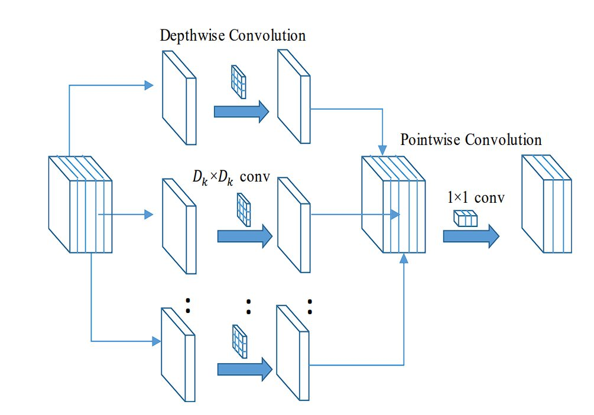

# Intelligente Fließbandsteuerung durch Deep-Learning-Bilderkennung mit Edge Impulse und Arduino Nicla Vision 

## Inhalt
*   [Einleitung](#einleitung) 
    *   [Ziel des Projektes](#ziel-des-projektes)
*   [Methoden](#methoden)
    *   [Einführung in die Technologien](#einführung-in-die-technologien)
*   [Umsetzung](#umsetzung)
    *   [Transfer Learning Modelle](#transfer-learning-modelle)
    *   [Herausforderungen und Lösungen](#herausforderungen-und-lösungen)
    *   [Rapid Prototyping mit Edge Impulse](#rapid-prototyping-mit-edge-impulse)
*   [Testaufbau / Ergebnisse](#ergebnisse-test-aufbau)
    *   [Aufbau des endgültigen Systems](#aufbau-des-endgültigen-systems)
    *   [Ergebnisse](#ergebnisse)
    *   [Grenzen und Optimierungspotenziale](#grenzen-und-optimierungspotenziale)
    *   [Änderungen seit Ende der Entwicklungen an Projekt](#änderungen-seit-ende-der-entwicklungen-an-projekt)
*   [Zusammenfassung & Ausblick](#zusammenfassung-ausblick)

## Einleitung
### Ziel des Projektes  
Ziel dieses Projekts ist die Entwicklung einer intelligenten Fließbandsteuerung durch einen iterativen "Rapid Prototyping"-Prozess. Mithilfe eines Edge-Geräts zur Bilderkennung soll das Fließband automatisch gesteuert werden. Dabei wird je nach erkanntem Objekt ein Anhaltevorgang ausgelöst. Ein besonderer Fokus liegt auf der Nutzung der Plattform "Edge Impulse" für die Entwicklung und Bereitstellung des Modells. Zusätzlich kommen weitere Tools zur Datengenerierung zum Einsatz, die mit "Edge Impulse" zusammenarbeiten können.

## Methoden

### Einführung in die Technologien:
Im Folgenden werden die wichtigsten genutzten Technologien einleitend vorgestellt und begründet, warum sie verwendet wurden.

#### Edge Impulse:
Bei Edge Impulse handelt es sich um eine Plattform, die speziell für die Entwicklung von Machine-Learning- und Deep-Learning-Modellen auf "Embedded Devices" wie [Microcontrollern](https://docs.edgeimpulse.com/docs/edge-ai-hardware/mcu), [Einplatinencomputern](https://docs.edgeimpulse.com/docs/edge-ai-hardware/cpu/raspberry-pi-4), aber auch leistungsfähigen Geräten wie [NVIDIA Jetson](https://docs.edgeimpulse.com/docs/edge-ai-hardware/gpu/nvidia-jetson) entwickelt wurde. 

Edge Impulse unterstützt den gesamten Entwicklungsprozess – vom Sammeln der Daten bis hin zum fertigen "Impulse". Ein Impulse bezeichnet hierbei das komplette Machine-Learning-Modell, das aus mehreren Komponenten besteht und auf ein Edge-Gerät übertragen werden kann. Zusätzlich bietet Edge Impulse die Möglichkeit, das Modell mithilfe eines [Smartphones](https://docs.edgeimpulse.com/docs/edge-ai-hardware/using-your-mobile-phone) zu testen, was die Einstiegshürde erheblich senkt.

##### Für Einsteiger:
Edge Impulse richtet sich sowohl an [Anfänger](https://docs.edgeimpulse.com/docs/readme/for-beginners) als auch an [Fortgeschrittene](https://docs.edgeimpulse.com/docs/readme/for-ml-practitioners). Es unterstützt einen [Low-Code](https://docs.edgeimpulse.com/docs/readme/for-beginners#why-edge-impulse-for-beginners)-Ansatz, bei dem eine Web-GUI Schritt für Schritt durch die Entwicklung führt. Diese Umgebung wird [Edge Impulse Studio](https://docs.edgeimpulse.com/docs/edge-impulse-studio/organizations) genannt. Zudem wird eine breite Masse an Geräten nativ unterstützt, sodass keine zusätzliche Einrichtung von Sensoren und Geräten notwendig ist.

Außerdem gibt es eine Reihe von ["End-to-End"-Tutorials](https://docs.edgeimpulse.com/docs/tutorials/end-to-end-tutorials), denen man folgen kann – beispielsweise zu [Sound Classification](https://docs.edgeimpulse.com/docs/tutorials/end-to-end-tutorials/audio), [Bild- und Objekterkennung](https://docs.edgeimpulse.com/docs/tutorials/end-to-end-tutorials/computer-vision) sowie fortgeschrittenen Themen wie [Sensor Fusion](https://docs.edgeimpulse.com/docs/tutorials/end-to-end-tutorials/time-series/sensor-fusion).

Die [Community-Version](https://edgeimpulse.com/pricing) ist kostenlos und bietet alle nötigen Features für erste Projekte ohne große Einschränkungen.

Besonders hervorzuheben ist, dass die Plattform alle notwendigen Schritte integriert: Projektverwaltung, [Datenerfassung](https://docs.edgeimpulse.com/docs/edge-impulse-studio/data-acquisition), [Preprocessing](https://docs.edgeimpulse.com/docs/edge-impulse-studio/processing-blocks), [Modelltraining](https://docs.edgeimpulse.com/docs/edge-impulse-studio/learning-blocks), [Modelltests](https://docs.edgeimpulse.com/docs/edge-impulse-studio/model-testing) und – als Besonderheit – die sogenannte [Live Classification](https://docs.edgeimpulse.com/docs/edge-impulse-studio/live-classification). Dabei werden die Daten direkt vom Gerät an Edge Impulse gesendet und dort vom Modell klassifiziert. Dies ist besonders praktisch für schnelles Testen und unterstützt eine schnelle Entwicklung, da das Modell nicht jedes Mal neu auf das Gerät übertragen werden muss.

So fördert Edge Impulse einen Rapid-Prototyping-Ansatz, bei dem ein Modell kontinuierlich optimiert und getestet werden kann. Dabei hilft auch die Funktion [Retrain Model](https://docs.edgeimpulse.com/docs/edge-impulse-studio/retrain-model) – eine Art Shortcut, um neue Daten einfach in das Training mit aufzunehmen. Das erneute Training löst dann automatisch Preprocessing, Modelltraining und Modelltests aus.

Zum Schluss bietet die Plattform verschiedene Optionen zum [Deployen](https://docs.edgeimpulse.com/docs/edge-impulse-studio/deployment), auf die in einem [späteren Abschnitt](#möglichkeiten-zum-deployen-c-micro-python-und-direktes-deployen) näher eingegangen wird.

Außerdem kann Edge Impulse die Daten – falls gewünscht – automatisch in Trainings- und Testdatensätze aufteilen. All das hilft dabei, schnell und einfach ein funktionierendes Modell zu erstellen.

##### Für Fortgeschrittene  
Für fortgeschrittene Nutzer ist Edge Impulse ebenfalls geeignet. Hat man beispielsweise bereits vorhandene Daten, können diese über verschiedene Tools wie das [CLI Tool](https://docs.edgeimpulse.com/docs/tools/edge-impulse-cli) hochgeladen werden. Hierbei werden diverse Dateiformate unterstützt. Alternativ besteht die Möglichkeit des [Bring Your Own Model](https://docs.edgeimpulse.com/docs/edge-impulse-studio/bring-your-own-model-byom): Dabei kann ein eigenes Modell hochgeladen und profiliert werden – die On-Device-Performance wird also berechnet. Anschließend kann das Modell exportiert werden.

Ein zentrales Feature ist dabei der [EON Compiler](https://docs.edgeimpulse.com/docs/edge-impulse-studio/deployment/eon-compiler), der dabei hilft, [LiteRT / TensorFlow](https://developers.googleblog.com/en/tensorflow-lite-is-now-litert/)-Modelle noch effizienter zu nutzen – mehr dazu in einem [späteren Abschnitt](#möglichkeiten-zum-deployen-c-micro-python-und-direktes-deployen).

Des Weiteren steht ein [Python SDK](https://docs.edgeimpulse.com/docs/tools/edge-impulse-python-sdk) zur Verfügung, falls man auf die grafische Oberfläche verzichten möchte. Ein weiterer Vorteil ist die sehr ausführliche Dokumentation.

Außerdem besteht die Möglichkeit, das Modell auch unabhängig von den unterstützten Devices zu verwenden – solange sie beispielsweise [C++](https://docs.edgeimpulse.com/docs/run-inference/cpp-library) unterstützen. So bietet Edge Impulse dem Nutzer viele Freiheiten und Auswahlmöglichkeiten hinsichtlich der verwendeten Tools, ohne auf die Vorteile der Plattform verzichten zu müssen.

---

##### Vorteile für dieses Projekt  
Im Bezug auf dieses Projekt ergeben sich mehrere Vorteile: Da das Projekt von Grund auf neu gestartet wurde, bietet sich die Möglichkeit, alle Schritte – vom Datensammeln bis zum Deployen – direkt in Edge Impulse umzusetzen. Alternativ können für bestimmte Schritte, wie z. B. das Labeln der Daten, auch andere Tools genutzt werden, die diese Aufgaben vereinfachen. Optional können die Daten bereits vorverarbeitet werden, etwa durch Data Augmentation.

Der Hauptvorteil liegt jedoch im schnellen Testen und Optimieren des Modells. Dadurch kann ein erstes funktionierendes Modell zügig erstellt werden, das mit verschiedenen Modelltypen getestet werden kann, um die optimale Lösung für die gestellte Aufgabe zu finden. Die GUI hilft dabei, Probleme wie schlechte Datenqualität oder Overfitting frühzeitig zu erkennen und gezielt zu beheben.

Darüber hinaus besteht die Möglichkeit, verschiedene Deployment-Methoden zu testen – etwa eine [fertige Firmware](https://docs.edgeimpulse.com/docs/run-inference/firmwares), die direkt auf ein unterstütztes Gerät gespielt wird, oder die Nutzung als [OpenMV-Projekt](https://docs.edgeimpulse.com/docs/run-inference/running-your-impulse-openmv) (MicroPython) bzw. als klassisches [Arduino-Projekt](https://docs.edgeimpulse.com/docs/run-inference/arduino-library). So kann flexibel entschieden werden, ob maximale Performance oder einfaches Programmieren (z. B. mit MicroPython) bevorzugt wird.


#### Vorstellung des Edge-Gerätes und Alternativen
##### Nicla Vision

Für das Projekt standen zwei Mikrocontroller zur Verfügung. Einer davon ist der sehr kompakte [Arduino Nicla Vision](https://store.arduino.cc/collections/nicla-family/products/nicla-vision) mit einer Größe von nur 22.86 mm x 22.86 mm. Dieser Arduino verfügt über eine 2-Megapixel-Farbkamera sowie diverse weitere Sensoren, wie eine IMU und ein Mikrofon, dazu 1 MB RAM und 2 MB Flash-Speicher.

Als Herzstück dient ein [STM32](https://en.wikipedia.org/wiki/STM32)-Chip – ein 32-Bit-Mikrocontroller mit zwei Kernen: einem [Cortex-M7](https://en.wikipedia.org/wiki/ARM_Cortex-M#Cortex-M7) mit 480 MHz und einem [Cortex-M4](https://en.wikipedia.org/wiki/ARM_Cortex-M#Cortex-M4) mit 240 MHz. Der M7-Kern bietet dabei etwas mehr Rechenleistung, während der M4-Kern energieeffizienter arbeitet. Standardmäßig nutzt Edge Impulse den M7 für bessere Performance, was auch [empfohlen wird](https://www.edgeimpulse.com/blog/announcing-official-support-for-the-arduino-nicla-vision/).

Aufgrund seiner Architektur eignet sich der M7 besonders gut für rechenintensive Aufgaben – unter anderem dank seiner sechsstufigen [Superskalarpipeline](https://en.wikipedia.org/wiki/Superscalar_processor), die mehrere Instruktionen pro Takt verarbeiten kann, und einer integrierten [Floating-Point Unit (FPU)](https://de.wikipedia.org/wiki/Gleitkommaeinheit). Der Mikrocontroller ist außerdem so stromsparend, dass er problemlos mit einer Batterie betrieben werden kann.

Wichtig ist jedoch, dass sich beide Kerne den verfügbaren RAM teilen – kein Kern kann den gesamten Speicher exklusiv nutzen. Diese Information findet sich leider nicht explizit im [Datenblatt](https://docs.arduino.cc/resources/datasheets/ABX00051-datasheet.pdf). Die Speicherverteilung lässt sich allerdings anpassen, wenn man mit der Arduino-Bibliothek arbeitet.

```C++
    // initialise M4 RAM
    // Arduino Nicla Vision has 512KB of RAM allocated for M7 core
    // and additional 244k (sic!) on the M4 address space
    // allocating 288 kB as in the line below was
    // advised by a member of Arduino team
    malloc_addblock((void*)0x30000000, 288 * 1024);
``` 

Damit ist das Arbeiten mit dem Nicla Vision für Einsteiger leider nicht ganz einfach und könnte gerade bei der Nutzung der Standard-Firmware oder von MicroPython zu Verwirrung führen. Der Mikrocontroller verfügt außerdem über [16 MB externen Flash-Speicher].

Zur genauen Bezeichnung des Chips ["STM32H747AII6"](https://store.arduino.cc/en-de/products/nicla-vision) lassen sich keine weiteren offiziellen Informationen finden. Vermutlich handelt es sich um eine speziell für Arduino gefertigte Variante, die im Aufbau jedoch weitgehend dem [STM32H747](https://www.st.com/en/microcontrollers-microprocessors/stm32h747-757.html) entspricht.

Insgesamt ist der Nicla Vision ein sehr gut geeigneter Mikrocontroller, der alle notwendigen Komponenten in einem kompakten Gerät vereint. Lediglich der Speicher könnte bei größeren Modellen etwas knapp werden. Aufgrund seiner geringen Größe eignet er sich jedoch für nahezu jeden Einsatzbereich. Passende [Gehäuse](https://www.printables.com/model/208400-arduino-nicla-vision-case?lang=de) lassen sich zudem mit einem 3D-Drucker selbst herstellen.

##### Portenta H7 mit Vision Shield

Als zweites Gerät stand ein [Arduino Portenta H7](https://store.arduino.cc/en-de/products/portenta-h7?selectedStore=us) mit [Vision Shield](https://store.arduino.cc/products/arduino-portenta-vision-shield-ethernet?_pos=1&_psq=AVX00039+OR+ASX00031+OR+ASX00027+OR+ASX00021&_ss=e&_v=1.0) zur Verfügung. Auch dieses Setup wird [vollständig von Edge Impulse unterstützt](https://docs.edgeimpulse.com/docs/edge-ai-hardware/mcu/arduino-portenta-h7).

Zum Einsatz kommt hier ein [STM32H747XI](https://content.arduino.cc/assets/Arduino-Portenta-H7_Datasheet_stm32h747xi.pdf), der bereits über internen RAM verfügt (je nach Quelle 1–2 MB). Zusätzlich wird der Speicher durch ein externes [8 MB SDRAM](https://docs.arduino.cc/resources/datasheets/ABX00042-ABX00045-ABX00046-datasheet.pdf) erweitert. Darüber hinaus stehen 16 MB Flash-Speicher zur Verfügung. Damit eignet sich der Portenta hervorragend für ein breites Spektrum von Edge-Anwendungen. Durch das wechselbare [Shield](https://store.arduino.cc/products/arduino-portenta-vision-shield-ethernet?_pos=1&_psq=AVX00039+OR+ASX00031+OR+ASX00027+OR+ASX00021&_ss=e&_v=1.0) ist das System zudem sehr anpassungsfähig.

Das verwendete Shield bietet unter anderem zwei Mikrofone sowie eine Kamera mit einer Auflösung von 320×320 Pixeln. Leider handelt es sich dabei lediglich um eine [Graustufen-Kamera](https://forum.arduino.cc/t/portenta-h7-vision-shield-unable-to-capture-color-image/889926), was von Arduino eher unauffällig kommuniziert wird. Daher eignet sich das Gerät nur für Anwendungen, die auf Form- oder Mustererkennung basieren. Da in diesem Projekt jedoch auch farbliche Elemente unterschieden werden sollten, kam der Portenta H7 trotz seines größeren Speichers nicht zum Einsatz.

Beide Geräte verfügen außerdem über WIFI und Bluetooth – diese Funktionen wurden im Rahmen des Projekts jedoch nicht benötigt. Zudem bieten sie vorbereitete Anschlüsse für [GPIO](https://content.arduino.cc/assets/Pinout_NiclaVision_latest.png), allerdings ohne vormontierte [Header](https://www.reichelt.de/de/de/shop/produkt/2x10pol_stiftleiste_gewinkelt_rm_1_27-51748), die bei Bedarf selbst angebracht werden müssen (mehr dazu im Abschnitt [„Herausforderungen einer stabilen Verbindung“](#herausforderungen-einer-stabilen-elektrischen-verbindung)).

Beide Mikrocontroller können nicht nur mit C/C++ programmiert werden, sondern unterstützen auch [MicroPython](https://micropython.org).

##### Alternativen

Beide vorgestellten Geräte verfügen über keinen dedizierten „AI-Beschleuniger“. Hier könnten Mikrocontroller wie der [Seeed Grove Vision AI](https://docs.edgeimpulse.com/docs/edge-ai-hardware/mcu-+-ai-accelerators/seeed-grove-vision-ai) eine interessante Option darstellen. Alternativ wäre auch der [Espressif ESP-EYE](https://docs.edgeimpulse.com/docs/edge-ai-hardware/mcu/espressif-esp32) eine Möglichkeit. Dieser basiert auf dem weit verbreiteten [ESP32](https://de.wikipedia.org/wiki/ESP32) und stellt eine kostengünstigere Alternative zu den Arduino-Lösungen dar. Die Leistung ist mit der des H7 vergleichbar. Zwar werden andere Modelle auf ESP32-Basis nicht nativ unterstützt, jedoch ist laut [Edge Impulse](https://docs.edgeimpulse.com/docs/edge-ai-hardware/mcu/espressif-esp32) auch deren Einsatz grundsätzlich möglich.

Wenn eine Objekterkennung mit Bounding Boxes erforderlich ist, empfiehlt Edge Impulse den Einsatz eines [Raspberry Pi 4](https://docs.edgeimpulse.com/docs/edge-ai-hardware/cpu/raspberry-pi-4). Dieser nutzt bereits ein Linux-Betriebssystem, wodurch theoretisch auch jedes andere Linux-basierte System verwendbar wäre. Für noch komplexere Anwendungen wäre die Nutzung von [NVIDIA Jetson](https://docs.edgeimpulse.com/docs/edge-ai-hardware/gpu/nvidia-jetson) interessant, da hier eine GPU zur Verfügung steht, um auch größere Modelle effizient zu verarbeiten.

Für den Einsatzzweck dieses Projekts scheint der Nicla Vision jedoch eine sehr gute Wahl zu sein. Er bietet alle notwendigen Features für einfache Bildverarbeitungsaufgaben, ist äußerst energieeffizient und kompakt. Sollte jedoch eine Objekterkennung erforderlich sein, wäre ein Raspberry Pi eine leistungsstarke und ausreichend schnelle Alternative.


#### Genutzte Tools

Im Folgenden werden die verwendeten Tools neben dem [Edge Impulse Studio](https://docs.edgeimpulse.com/docs/edge-impulse-studio/dashboard) vorgestellt, die für die Umsetzung des Projekts zum Einsatz kamen. Je nach Vorgehensweise müssen nicht alle Tools verwendet werden. Da verschiedene Ansätze zum Datensammeln und Deployen getestet wurden, gibt es hier auch teilweise ähnliche Tools. Im Weiteren wird die Nutzung der Tools mit dem Arduino Nicla Vision beschrieben.

##### Edge Impulse CLI

Die [Edge Impulse CLI](https://docs.edgeimpulse.com/docs/tools/edge-impulse-cli) ist eine Kommandozeilenanwendung zur Interaktion mit der Online-Plattform. Sie unterstützt die Verbindung von Geräten ohne eigene Internetverbindung (z. B. Mikrocontroller) mit dem [Edge Impulse Studio](https://docs.edgeimpulse.com/docs/edge-impulse-studio/dashboard). Damit können Geräte u. a. für das [Datensammeln](https://docs.edgeimpulse.com/docs/edge-impulse-studio/data-acquisition#collect-data) oder die [Live-Klassifikation](https://docs.edgeimpulse.com/docs/edge-impulse-studio/live-classification) eingesetzt werden.

Nach der [Installation der CLI](https://docs.edgeimpulse.com/docs/tools/edge-impulse-cli/cli-installation) kann das Gerät mit dem [Daemon](https://docs.edgeimpulse.com/docs/tools/edge-impulse-cli/cli-daemon) verbunden werden. Dabei wird das Gerät einem Projekt zugewiesen. Soll es für ein anderes Projekt verwendet werden, muss dies beim Start des Daemons mit `--clean` angegeben werden.

Auch enthalten ist der [Uploader](https://docs.edgeimpulse.com/docs/tools/edge-impulse-cli/cli-uploader), mit dem lokal gesammelte Daten dem Projekt hinzugefügt werden können – eine Alternative zum [Studio Uploader](https://docs.edgeimpulse.com/docs/edge-impulse-studio/data-acquisition/uploader). Beide Varianten unterstützen gängige Dateiformate wie JSON, CSV, WAV, JPG, PNG und MP4 sowie verschiedene Annotation-Formate. Dadurch ist ein erneutes Labeln im Studio nicht notwendig.

Außerdem kann direkt aus der CLI der in der Firmware enthaltene Impulse mit folgendem Befehl ausgeführt werden:

```
edge-impulse-run-impulse 
```


In der [Standard-Firmware](https://docs.edgeimpulse.com/docs/edge-ai-hardware/mcu/arduino-nicla-vision#id-2.-update-the-firmware) ist ein kleines Demoprojekt enthalten. Hat man seinen eigenen Impulse als [Firmware deployed](https://docs.edgeimpulse.com/docs/edge-ai-hardware/mcu/arduino-nicla-vision#id-2.-update-the-firmware), [startet man ihn](https://docs.edgeimpulse.com/docs/tools/edge-impulse-cli/cli-run-impulse) ebenfalls über die CLI.

Wenn das Gerät etwa für die Live-Klassifikation genutzt werden soll, muss zunächst die passende Firmware aufgespielt werden. Anschließend startet man den Daemon mit:

```
edge-impulse-daemon
```


Oder – falls eine bestehende Konfiguration ignoriert werden soll – mit:

```
edge-impulse-daemon ----clean
```

Folgt man den Anweisungen der CLI und sind die Anmeldedaten korrekt, verbindet sich das Gerät automatisch mit der Online-Plattform. Nach kurzem Warten kann es verwendet werden. Es kommt zu leichten Latenzen, die Nutzung ist jedoch flüssig genug. Eine [Live-Vorschau](https://docs.edgeimpulse.com/docs/edge-impulse-studio/live-classification#using-a-fully-supported-development-board) des Bilds wird angezeigt, Sensoren und Auflösungen sind wählbar. Alternativ kann auch mit hochgeladenen Daten getestet werden.

Für den Uploader hat sich folgender Befehl als hilfreich erwiesen:

```
edge-impulse-uploader --format-openmv "C:\Users\justi\OneDrive\Dokumente\9.Semster\Praxis Projekt\DataSet"
```


Dabei gibt `--format` das verwendete Dataset-Format an – in diesem Fall das der [OpenMV IDE](https://openmv.io/pages/download?srsltid=AfmBOorxo6dnV2pmttWXr0MJ3MReW986QQj1MHbq0iKWSXr03XjyhBXs). Dahinter folgt der Pfad zum Ordner mit den Daten.

Ein Vorteil des Uploaders: Duplikate werden nicht erneut hochgeladen – das beschleunigt Entwicklung und Optimierung.  


Wichtig ist bei der [Installation](https://docs.edgeimpulse.com/docs/tools/edge-impulse-cli/cli-installation#installation-windows), dass sowohl Python 3 als auch Node.js vorhanden sind. Es kann sein, dass danach noch Build Tools fehlen – in diesem Fall hilft die Installation von Visual Studio oder die [Neuinstallation von Node.js](https://docs.edgeimpulse.com/docs/tools/edge-impulse-cli/cli-installation#error-could-not-locate-the-bindings-file.-windows).

Gerade wegen der teils aufwändigen Installation ist die CLI für unerfahrene Nutzer nicht zu empfehlen. Hier bietet sich der integrierte [Uploader im Studio](https://docs.edgeimpulse.com/docs/edge-impulse-studio/data-acquisition/uploader) an. Dennoch bieten einige Funktionen der CLI – wie der [Impulse Runner](https://docs.edgeimpulse.com/docs/tools/edge-impulse-cli/cli-run-impulse) – viele Vorteile, ebenso wie der Uploader. Das Tool lohnt sich daher besonders für erfahrene Nutzer.

Alternativ kann die CLI auch unter [WSL](https://docs.edgeimpulse.com/docs/tools/edge-impulse-cli/cli-run-impulse) installiert werden.

##### OpenMV IDE

Die [OpenMV IDE](https://openmv.io/pages/download?gad_source=1&gclid=EAIaIQobChMIi8bRwIOMjQMVXYpoCR3cdBlkEAAYASAAEgIrVvD_BwE) ist eine Entwicklungsumgebung zur Programmierung der [OpenMV Cams](https://docs.openmv.io/openmvcam/quickref.html). Sie ermöglicht die Programmierung mit [MicroPython](https://micropython.org/) und unterstützt neben den Geräten von [OpenMV](https://openmv.io/) auch einige andere Microcontroller, darunter die [Nicla Vision](#nicla-vision) und den [Portenta H7 mit Vision Shield](#portenta-h7--mit-vision-shield). Dies wird auch direkt in der [Arduino-Dokumentation](https://docs.arduino.cc/tutorials/nicla-vision/user-manual/#with-openmv-ide) angegeben.

Ein großer Vorteil der OpenMV IDE ist die einfache Handhabung: Sie ist MicroPython-basiert und somit besonders einsteigerfreundlich. Sobald ein unterstütztes Gerät angeschlossen ist und das „Connect“-Symbol angeklickt wird, wird das Gerät automatisch erkannt. Anschließend wird die [richtige Firmware](https://docs.arduino.cc/tutorials/nicla-vision/user-manual/#with-openmv-ide) automatisch installiert.


Ein weiteres praktisches Feature der IDE ist die rechte Seitenleiste mit einer Live-Kamera-Vorschau und einem Histogramm-Display:


Gerade beim Sammeln von Trainingsdaten ist dies besonders hilfreich. Hierfür gibt es auch einen integrierten, vorgefertigten Modus zum Datensammeln. Dieser lässt sich wie folgt starten:

```
Extras -> Datensatzteditor
```
Je nach Anwendungsfall kann man entweder einen neuen Datensatz erstellen oder einen bestehenden erneut öffnen.

Im Datensatz-Editor:


findet sich die Datei **„Dataset Capture Script“** – hierbei handelt es sich um ein Python-Skript, das für die Konfiguration der Bildaufnahme zuständig ist. Wenn das Skript ausgeführt wird, zeigt die Vorschau das aktuelle Kamerabild, darunter werden die Histogramme der einzelnen Farbkanäle angezeigt.

Die Programmierung mit MicroPython ermöglicht dabei einen kompakten und gut verständlichen Code. So lassen sich die Parameter für das Datensammeln schnell und unkompliziert anpassen.

```Python
# Use this script to control how your OpenMV Cam captures images for your dataset.
# You should apply the same image pre-processing steps you expect to run on images
# that you will feed to your model during run-time.

import sensor, image, time

sensor.reset()
sensor.set_pixformat(sensor.RGB565) # Modify as you like.
sensor.set_framesize(sensor.QVGA) # Modify as you like.
sensor.set_windowing((320,240))
sensor.skip_frames(time = 2000)

clock = time.clock()

while(True):
    clock.tick()
    img = sensor.snapshot()
    # Apply lens correction if you need it.
    # img.lens_corr()
    # Apply rotation correction if you need it.
    # img.rotation_corr()
    # Apply other filters...
    # E.g. mean/median/mode/midpoint/etc.
    print(clock.fps())
```

Die Bilder für das Training werden in Ordnern gespeichert, deren Namen gleichzeitig als Label dienen. Jeder dieser Ordner endet auf `.class`.

Über die beiden Buttons auf der linken Seite:


können neue Ordner erstellt und Fotos aufgenommen werden. Die Bilder werden dabei automatisch in den aktuell ausgewählten Ordner eingefügt.

Zusätzlich befindet sich im Dataset eine Datei namens `labels.txt`, die eine Auflistung aller vorhandenen Ordner bzw. Labels enthält.

Ein weiteres nützliches Feature: Dieses Dataset kann – ähnlich wie mit der [Edge Impulse CLI](https://docs.edgeimpulse.com/docs/tools/edge-impulse-cli/cli-uploader) – direkt aus der IDE heraus hochgeladen werden.

```
Extras -> Datensatzteditor -> Export -> In Edge Impulse Projekt hochladen 
```

Hier kann nach der Anmeldung das Projekt ausgewählt werden, und es lässt sich anschließend die Aufteilung zwischen Trainings- und Testdaten festlegen.

Auch beim Deployen bietet Edge Impulse die Möglichkeit, den Impulse direkt für die OpenMV IDE zu exportieren. Mehr dazu im folgenden [Abschnitt](#möglichkeiten-zum-deployen-des-impulses).

Gerade das sehr einfach gestaltete Labeling eignet sich ideal für die erste Datensammlung, da hiermit schnell eine größere Menge unterschiedlicher Bilder erstellt werden kann. Besonders hilfreich ist dabei die gute Vorschaufunktion sowie das unkomplizierte Label-Format, das auch Nutzer:innen ohne Vorerfahrung problemlos verstehen können.

##### Arduino IDE

Die Arduino IDE ist eine von der Arduino Foundation entwickelte Integrated Development Environment (IDE), die speziell dafür konzipiert wurde, das Programmieren von Mikrocontrollern zu vereinfachen. Sie verwendet einen vereinfachten und erweiterten C/C++-Dialekt. Sie ist sehr simpel aufgebaut und daher gut für Programmierneulinge geeignet.

Hierfür bietet sie die wichtigsten Funktionen einer IDE wie das Schreiben, Kompilieren und Hochladen von Programmen. Zusätzlich verfügt sie über einen [Serial Monitor](https://docs.arduino.cc/software/ide-v2/tutorials/getting-started-ide-v2/?_gl=1*1793bdg*_up*MQ..*_ga*MTM1OTY1MjA4Ny4xNzQ2NTIyMzYw*_ga_NEXN8H46L5*czE3NDY1MjIzNTgkbzEkZzEkdDE3NDY1MjM3MjQkajAkbDAkaDc0MzE4NTY4Mw..#serial-monitor), um Interaktionen zwischen Controller und Rechner zu beobachten.

Das für dieses Projekt wichtigste Feature ist der [Board Manager](https://docs.arduino.cc/software/ide-v2/tutorials/ide-v2-board-manager/?_gl=1*1rln9l*_up*MQ..*_ga*MTM1OTY1MjA4Ny4xNzQ2NTIyMzYw*_ga_NEXN8H46L5*czE3NDY1MjIzNTgkbzEkZzEkdDE3NDY1MjM3MjUkajAkbDAkaDc0MzE4NTY4Mw..#requirements). Es handelt sich hierbei um ein Tool, um Treiber und Bibliotheken für verschiedene Mikrocontroller zu installieren und deren Versionen zu verwalten.


Diese Treiber sollten unbedingt installiert werden, da sie – auch wenn mit einem anderen Editor wie [Visual Studio Code](#vsc-und-platformio) gearbeitet wird – notwendig für das korrekte Deployen sind. Für das [Nicla Board](https://docs.arduino.cc/software/ide-v2/tutorials/ide-v2-board-manager/?_gl=1*1rln9l*_up*MQ..*_ga*MTM1OTY1MjA4Ny4xNzQ2NTIyMzYw*_ga_NEXN8H46L5*czE3NDY1MjIzNTgkbzEkZzEkdDE3NDY1MjM3MjUkajAkbDAkaDc0MzE4NTY4Mw..#mbed-os-nicla) und das [Portenta Board](https://docs.arduino.cc/software/ide-v2/tutorials/ide-v2-board-manager/?_gl=1*1rln9l*_up*MQ..*_ga*MTM1OTY1MjA4Ny4xNzQ2NTIyMzYw*_ga_NEXN8H46L5*czE3NDY1MjIzNTgkbzEkZzEkdDE3NDY1MjM3MjUkajAkbDAkaDc0MzE4NTY4Mw..#mbed-os-portenta) gibt es jeweils separate Pakete.

Werden diese Treiber nicht installiert, kann es zu Problemen beim Erkennen des Geräts kommen.

Ein Beispiel hierfür wäre:

```
Cannot open DFU device 2341:035f found on devnum 12 (LIBUSB_ERROR_NOT_FOUND)
No DFU capable USB device available
*** [upload] Error 74
```

Es gibt auch Alternativen zum Installieren notwendiger Treiber wie etwa [Zadig](https://zadig.akeo.ie/), allerdings bietet die Arduino IDE hier die zuverlässigste Möglichkeit zur Installation.

[Edge Impulse](https://docs.edgeimpulse.com/docs/run-inference/arduino-library) bietet die Möglichkeit, einen Impulse als **Arduino Library zu deployen**. Diese wird als `.zip`-Datei bereitgestellt und kann sehr einfach direkt in der Arduino IDE eingebunden werden. Auch hier zeigt sich wieder die Einsteigerfreundlichkeit der Plattform.

Allerdings ist im Verlauf des Projekts aufgefallen, dass das Kompilieren und das anschließende Hochladen der Anwendung sehr lange dauern können – bei komplexeren Impulsen bis zu 15 Minuten, in der Regel aber über 5 Minuten. Während dieser Wartezeit wird nur wenig Feedback angezeigt, sodass der Nutzer kaum nachvollziehen kann, was genau geschieht.

Die lange Wartezeit scheint mit einer unzureichenden Ausnutzung der verfügbaren CPU-Kerne zusammenzuhängen:


Hier erkennt man deutlich, dass die CPU nicht vollständig ausgelastet wird.

Im Vergleich dazu zeigt sich bei der Kompilierung mit [Visual Studio Code und PlatformIO](#vsc-und-platformio) eine deutlich bessere Auslastung:


Zusammen mit der deutlich kürzeren Kompilierzeit (in der Regel 1–2 Minuten) deutet dies auf eine Schwäche der Arduino IDE in diesem Bereich hin. 

Für Einsteiger kann dies jedoch verkraftbar sein, da die Bedienung ansonsten sehr einfach und intuitiv ist. Zudem verliert dieser Aspekt an Relevanz, da Edge Impulse die Möglichkeit bietet, das ML-Modell direkt im Studio zu testen – ganz ohne vorheriges Deployen.


##### VSC und PlatformIO

Wie oben bereits angeschnitten, bietet [Visual Studio Code (VSC)](https://code.visualstudio.com/) zusammen mit der Extension [PlatformIO](https://platformio.org/) eine leistungsstarke Alternative zur Arduino IDE. Diese richtet sich insbesondere an fortgeschrittene Nutzer mit Erfahrung im Umgang mit Entwicklungsumgebungen. 

Im Gegensatz zur Arduino IDE, bei der Bibliotheken bequem per Mausklick über eine `.zip`-Datei hinzugefügt werden können ([Arduino Library einbinden](https://docs.edgeimpulse.com/docs/run-inference/arduino-library#test-your-impulse-the-static-buffer-example)), erfordert PlatformIO eine manuelle Einbindung: Die `.zip`-Datei muss selbst entpackt und anschließend in das Projektverzeichnis unter `lib` abgelegt werden. Dies setzt ein gewisses Maß an Erfahrung voraus, bietet jedoch deutlich mehr Kontrolle und Flexibilität in der Konfiguration. 

Die Einbindung von Bibliotheken erfolgt über die `platformio.ini`-Datei. Eine ausführliche [Dokumentation](https://docs.platformio.org/en/latest/librarymanager/index.html) hilft dabei, sich schnell zurechtzufinden. Dank der Integration in VSC profitieren Nutzer zudem von einer übersichtlichen Projektstruktur sowie von modernen Entwicklungsfunktionen wie [IntelliSense](https://code.visualstudio.com/docs/editing/intellisense) mit Codevervollständigung, Parameterhinweisen und Fehlererkennung in Echtzeit.

Ein weiterer Vorteil: PlatformIO unterstützt mehr als 1500 Boards, auch über die Arduino-Welt hinaus. 

Für das vorliegende Projekt sind sowohl die Arduino IDE als auch PlatformIO geeignet. Die Arduino IDE punktet mit ihrer einfachen Handhabung, insbesondere beim Einrichten des [Nicla Vision Boards](https://docs.arduino.cc/tutorials/nicla-vision/user-manual/). PlatformIO hingegen bietet Vorteile beim Testen und Anpassen des deployten Impulses – insbesondere durch die deutlich schnellere Kompilierung.

Letztlich hängt die Wahl des Tools auch von persönlichen Vorlieben ab. Für mich persönlich bot PlatformIO die beste Lösung. Dennoch kam auch die Arduino IDE zum Einsatz, beispielsweise für das einfache Setup mit dem Board-Manager.

#### Möglichkeiten zum Deployen des Impulses

Im folgenden Abschnitt werden verschiedene Möglichkeiten zum [Deployen](https://docs.edgeimpulse.com/docs/edge-impulse-studio/deployment) eines Impulses betrachtet. Der Fokus liegt dabei auf den tatsächlich getesteten Varianten – speziell in Kombination mit dem **Nicla Vision** und dem **Portenta H7**.

---

##### Arduino Library (C/C++)

Die bekannteste Möglichkeit zur Programmierung von Arduino-Boards ist die Nutzung der [Arduino-Sprache](https://docs.arduino.cc/language-reference/), einer stark vereinfachten Variante von C/C++, die speziell für Einsteiger optimiert wurde. Die sogenannte Arduino Core Library bietet grundlegende Funktionen zur Ansteuerung von [I/O-Pins](https://docs.arduino.cc/language-reference/funktionen/digital-io/digitalread/), mathematischen Operationen und vielen weiteren Basisfunktionen.

**Edge Impulse** bietet die Möglichkeit, den entwickelten [Impulse](https://docs.edgeimpulse.com/docs/edge-impulse-studio/impulse-design-and-experiments) als optimierten Quellcode im Format einer [Arduino-Bibliothek](https://docs.arduino.cc/software/ide-v1/tutorials/installing-libraries/) bereitzustellen. Diese kann direkt in ein Arduino-Projekt eingebunden werden – entweder durch eigene Implementierung oder über eines der mitgelieferten Beispielprojekte (z. B. das `"static buffer"` Beispiel oder das für dieses Projekt angepasste [`nicla_vision_camera.ino`](src\nicla_vision_camera.ino)).

---

###### Modellvarianten und Optimierungen

Beim Export über das Edge Impulse Studio können verschiedene Optionen gewählt werden, die sich auf die Größe und Performance des Modells auswirken:

- **Quantisierung**: Die Umwandlung von Floating Point 32 (FP32) in Integer 8 (INT8) reduziert Speicherverbrauch und Latenz, kann aber die Genauigkeit beeinträchtigen. Dabei handelt es sich um eine [Post-Training-Quantisierung](https://applydata.io/de/quantisierung-in-der-ki/).
  
  

  Die Abbildung zeigt, dass das INT8-Modell nur etwa ein Drittel des RAMs des FP32-Modells benötigt – bei etwas geringerer Genauigkeit. Der genaue Einfluss auf die Genauigkeit variiert je nach Modell.

- **Speicherbeschränkungen**: Aufgrund des limitierten RAMs auf Geräten wie dem [Nicla Vision](#nicla-vision) sind nur quantisierte INT8-Modelle praktisch einsetzbar. Neben dem Modell belegen auch andere Daten (z. B. Bilder, Sensorwerte) Speicherplatz.

- **EON Compiler**: Der von Edge Impulse entwickelte [EON Compiler](https://docs.edgeimpulse.com/docs/edge-impulse-studio/deployment/eon-compiler) erzeugt aus dem `.tflite`-Modell optimierten C++-Code. Dieser verbraucht weniger RAM (25–65 %) und Flash-Speicher (10–35 %) bei gleichbleibender Genauigkeit.

  Der Performancegewinn wird erreicht, indem rechenintensive Aufgaben wie das Parsen des Graphen und die Speicherplanung bereits vor dem Kompilieren erledigt werden. Die RAM-optimierte Variante berechnet Zwischenwerte nur bei Bedarf – zulasten einer leicht erhöhten Latenz und Flash-Nutzung. Dies ist ein sinnvoller Kompromiss bei RAM-limitierten Systemen.

  Während TensorFlow Lite mit hoher [Flexibilität](https://docs.edgeimpulse.com/docs/edge-impulse-studio/deployment/eon-compiler#how-does-it-work) punktet, spielt der EON Compiler seine Stärken auf ressourcenlimitierten Mikrocontrollern aus.

---

#### Fazit

Die Bereitstellung eines Impulses als **Arduino-Bibliothek** stellt eine leistungsfähige und flexible Lösung dar. Sie ermöglicht den Einsatz auf verschiedenen Plattformen mit unterschiedlichen Leistungsprofilen und bietet zahlreiche Konfigurationsmöglichkeiten.

**Vorteile:**
- Direkte Integration in Arduino-Projekte
- Anpassung über Beispielprojekte möglich
- Unterstützung durch Quantisierung und EON Compiler

**Nachteile:**
- Grundkenntnisse in Arduino-Programmierung erforderlich
- Längere Kompilierzeiten im Vergleich zu anderen Optionen
- Etwas komplexere Handhabung für Einsteiger

Trotz kleiner Schwächen ist die Arduino-Library eine ausgezeichnete Option – besonders dann, wenn Flexibilität und vollständige Kontrolle über den Code gefragt sind.

##### OpenMV

Wie bereits im Abschnitt zur [OpenMV IDE](#openmv-ide) beschrieben, ist OpenMV eine Plattform, die zur Entwicklung auf Edge-Devices wie dem [Nicla Vision](#nicla-vision) oder dem [Portenta H7 – mit Vision Shield](#portenta-h7--mit-vision-shield) genutzt werden kann. Die Programmierung erfolgt hier in **MicroPython**, einer leichtgewichtigen Variante von Python, die speziell für Mikrocontroller entwickelt wurde.

Edge Impulse bietet die Möglichkeit, sowohl Daten direkt über die OpenMV IDE zu erfassen und zu labeln als auch den fertig trainierten Impulse als [OpenMV Library oder Firmware](https://docs.edgeimpulse.com/docs/run-inference/running-your-impulse-openmv) zu deployen.

Einfach gesagt handelt es sich bei dieser Methode um das Äquivalent zur Nutzung einer Arduino-Bibliothek, jedoch für MicroPython – technisch gesehen gibt es aber einige Unterschiede.

---

###### OpenMV Library

Das Deployen als OpenMV-Library ist sehr unkompliziert. Man wählt im Edge Impulse Studio einfach die entsprechende Variante aus – es sind dabei keine weiteren Einstellungen nötig.


Nach dem Export erhält man eine ZIP-Datei mit drei Elementen:


- `ei_image_classification.py`: Enthält den MicroPython-Code zur Ausführung des Modells mit der OpenMV IDE.
- `labels.txt`: Die Liste der erkannten Klassenlabels.
- `trained.tflite`: Das trainierte Modell im TensorFlow Lite (TFLite) Format.

**Wichtig:**  
Da MicroPython verwendet wird, unterstützt diese Methode **nur quantisierte INT8-Modelle**. Eine Nutzung des [EON Compilers](https://docs.edgeimpulse.com/docs/edge-impulse-studio/deployment/eon-compiler) ist nicht möglich, da dieser speziell für C++ gedacht ist.  
> Quelle: [Edge Impulse – Nur INT8 wird unterstützt](https://docs.edgeimpulse.com/docs/run-inference/running-your-impulse-openmv#only-quantized-int8-models-are-supported)

---

Die Nutzung erfolgt wie folgt:

1. Die `.tflite` und `.txt`-Dateien werden über das USB-Dateisystem direkt in das Root-Verzeichnis des Geräts kopiert (das Device erscheint als Laufwerk).
2. Die `.py`-Datei wird in der OpenMV IDE geöffnet und ausgeführt.

Diese Methode funktioniert auf allen von OpenMV unterstützten Boards, ist allerdings laut [Empfehlung von Edge Impulse](https://docs.edgeimpulse.com/docs/run-inference/running-your-impulse-openmv#deploying-your-impulse-as-an-openmv-library) **nur für kleinere Modelle sinnvoll**. Das liegt daran, dass MicroPython als interpretierte Sprache deutlich mehr RAM benötigt – was auf Geräten wie dem Nicla Vision zu Speicherproblemen führen kann.

---

###### OpenMV Firmware

Als Alternative bietet Edge Impulse auch das Deployen als [OpenMV Firmware](https://docs.edgeimpulse.com/docs/run-inference/running-your-impulse-openmv#deploying-your-impulse-as-an-openmv-firmware) an. Dabei erhält man wieder eine ZIP-Datei, die:

- Vorgefertigte Firmware-Dateien für jedes unterstützte Board enthält.
- Eine passende Python-Datei zur Ausführung des Modells auf dem Gerät.

Das Flashen der Firmware erfolgt über die OpenMV IDE:

```
 Tools->Run Bootloader (Load Firmware).
```

Hier kann man beim Export zwischen INT8 und Float32 Modellen wählen. Leider stellte sich im Test heraus, dass weder für das Nicla Vision noch den Portenta H7 eine passende Firmware-Datei enthalten war.


Daher konnte diese Variante leider nicht erfolgreich getestet werden. Vermutlich reicht der verfügbare Flash-/RAM-Speicher der Arduino-Versionen dieser Boards nicht aus, um die generierte Firmware korrekt zu laden.

Zusammenfassend bietet OpenMV mit MicroPython eine Möglichkeit, ML-Modelle direkt und schnell zu testen – allerdings mit Einschränkungen:

Vorteile:

    Schnelles Deployen.

    Volle Kompatibilität mit OpenMV IDE.

    MicroPython ist gut lesbar und einfach zu modifizieren.

Nachteile:

    Nur kleine Modelle sinnvoll einsetzbar.

    Kein EON Compiler verfügbar.

    Keine funktionierende Firmware für Nicla Vision / Portenta im Test.

Weitere Details zu praktischen Problemen im folgenden  Abschnitt [Speicherprobleme und deren Behebung](#speicherprobleme-und-deren-behebung).

##### Device Firmware

Eine weitere Möglichkeit zum Deployen des Impulses ist die Nutzung der [Edge Impulse Firmware](https://docs.edgeimpulse.com/docs/run-inference/firmwares). Dabei handelt es sich um sogenannte „ready-to-go binaries“, die direkt auf unterstützte Geräte geflasht werden können – ohne zusätzliche IDE oder Konfiguration. Der große Vorteil: Das Modell kann sofort getestet werden, ohne dass eigener Programmcode nötig ist. Einzige Voraussetzung ist die [Edge Impulse CLI](https://docs.edgeimpulse.com/docs/edge-impulse-cli/cli-installation).

Diese Methode eignet sich besonders zum schnellen Testen, bietet jedoch keine Möglichkeit zur Anpassung. Funktionen wie die Ansteuerung von Pins oder eigene Logik sind nicht umsetzbar. Die Firmware basiert technisch vermutlich auf einer Kombination aus [C++ Library](https://docs.edgeimpulse.com/docs/run-inference/cpp-library) und EON-optimierter Architektur. Entsprechend können auch hier Modelle quantisiert werden und der [EON Compiler](https://docs.edgeimpulse.com/docs/edge-impulse-studio/deployment/eon-compiler) genutzt werden.

In Tests ließ sich die Firmware problemlos auf den Geräten installieren. Auf dem [Portenta H7](#portenta-h7-mit-vision-shield) war sie auch lauffähig, allerdings besitzt dieses Board keine Farbkamera, sodass das Bilderkennungsmodell nur eingeschränkt getestet werden konnte. Auf dem [Nicla Vision](#nicla-vision) kam es hingegen zu Abstürzen. Die Firmware wurde zwar erfolgreich geflasht, beim Ausführen trat jedoch ein Fehler auf. Dies deutet stark auf die begrenzten RAM-Ressourcen hin, wie sie bereits bei der Nutzung der OpenMV-Library beobachtet wurden.

```
Inferencing settings:
        Image resolution: 96x96
        Frame size: 9216
        No. of classes: 7
Starting inferencing in 2 seconds...
Taking photo...
ERR: failed to allocate tensor arena
Failed to initialize the model (error code 1)
```

Insgesamt bietet die Device Firmware eine gute Möglichkeit, ein Modell ohne eigenen Entwicklungsaufwand zu testen – allerdings nur auf unterstützten Boards und ohne Spielraum für Anpassungen. Für ernsthafte Projekte ist sie daher nur bedingt geeignet. 


## Umsetzung

Im folgenden Abschnitt soll es um die konkrete Umsetzung des Projekts mit den zuvor vorgestellten Tools gehen. Hierbei soll es vor allem um Herausforderungen und deren Umsetzung gehen. Zusätzlich werden auch die verwendeten neuronalen Netze vorgestellt.

#### Transfer Learning Modelle

Für die Objekterkennung wurde sich in diesem Projekt für die Bildklassifikation entschieden. Edge Impulse bietet hierfür die Möglichkeit des [Transfer Learnings](https://docs.edgeimpulse.com/docs/edge-impulse-studio/learning-blocks/transfer-learning-images). Dabei wird ein bereits vortrainiertes Modell verwendet und auf einen neuen, aber ähnlichen Anwendungszweck angepasst.

Ein großer Vorteil des Transfer Learnings ist, dass dadurch weniger Trainingsdaten und kürzere Trainingszeiten benötigt werden. Das Prinzip beruht darauf, dass ein bestehender Feature-Extractor (Merkmalserkenner) beibehalten wird, während nur die oberen Schichten des neuronalen Netzes – also die Klassifizierungs-„Köpfe“ – durch neue ersetzt und auf die gewünschten Klassen trainiert werden. Dies geschieht in den oberen Layern des Netzwerks (siehe auch [Transfer Learning](https://datascientest.com/de/transfer-learning)).

Edge Impulse bietet hierfür bereits vorbereitete Modelle an. Im Rahmen dieses Projekts wurden die oberen drei Layer des Netzes entfernt:


```Python
last_layer_index = -3
model.add(Model(inputs=base_model.inputs, outputs=base_model.layers[last_layer_index].output))****
```

Stattdessen wird ein eigener Klassifikationskopf erstellt:

```Python
model.add(Reshape((-1, model.layers[-1].output.shape[3])))
model.add(Dense(8, activation='relu'))
model.add(Dropout(0.1))
model.add(Flatten())
model.add(Dense(classes, activation='softmax'))
```

Zusätzlich wird nach dem Training des neuen Klassifikationskopfs auch der Feature-Extraktor noch einmal optimiert.

```Python
model = ei_tensorflow.training.load_best_model(BEST_MODEL_PATH)
# Allow the entire base model to be trained
model.trainable = True
# Freeze all the layers before the 'fine_tune_from' layer
for layer in model.layers[:fine_tune_from]:
    layer.trainable = False
``` 

Bei dem oben stehenden Code handelt es sich um Ausschnitte aus dem Code, den Edge Impulse im [Expertenmodus](https://docs.edgeimpulse.com/docs/edge-impulse-studio/learning-blocks/transfer-learning-images#expert-mode) anzeigt. Er bezieht sich auf das MobileNetV2-Modell – beim V1-Modell sieht der Aufbau anders aus. 

Theoretisch besteht hier auch die Möglichkeit, das Modell weiter zu optimieren. Dies wurde im Projekt jedoch nicht genutzt, da die Auswahl an verschiedenen Modellen zunächst ausreichend war. Für erfahrene Nutzer bestehen hier sicherlich weitere Anpassungsmöglichkeiten.

##### Überblick über verschiedene Modelle

Im folgenden Abschnitt sollen die in Edge Impulse verfügbaren Modelle für das Transfer Learning mit Bildern näher betrachtet werden. Edge Impulse bietet aktuell drei [Architekturen](https://docs.edgeimpulse.com/docs/edge-impulse-studio/learning-blocks/transfer-learning-images#expert-mode) an. Jedes dieser Modelle ist mit unterschiedlichen Alpha-Werten verfügbar. Dieser Wert, auch bekannt als [Width Multiplier](https://viso.ai/deep-learning/mobilenet-efficient-deep-learning-for-mobile-vision/#mobilenet-architecture), beeinflusst die Anzahl der Kanäle pro Layer. Dadurch lässt sich das Modell verkleinern und beschleunigen – allerdings mit Auswirkungen auf die Genauigkeit. Mehr dazu im Abschnitt [Ergebnisse](#ergebnisse).

Zur Auswahl stehen die Modelle [MobileNetV1](https://docs.edgeimpulse.com/docs/edge-impulse-studio/learning-blocks/transfer-learning-images#mobilenetv1-1), [MobileNetV2](https://docs.edgeimpulse.com/docs/edge-impulse-studio/learning-blocks/transfer-learning-images#mobilenetv2-1) und [EfficientNet](https://docs.edgeimpulse.com/docs/edge-impulse-studio/learning-blocks/transfer-learning-images#efficientnet-1). In diesem Projekt wurden jedoch nur die beiden MobileNet-Modelle näher betrachtet, da die EfficientNet-Modelle mindestens 4 MB RAM benötigen und somit zu groß für den [Arduino Nicla Vision](#nicla-vision) sind.

Die MobileNetV1-Modelle wurden 2017 von einem Forscherteam bei Google [veröffentlicht](https://arxiv.org/abs/1704.04861). Es handelt sich dabei um eine Modellklasse, die speziell für mobile und eingebettete Anwendungen im Bereich der visuellen Erkennung entwickelt wurde. Ziel war es, die Modellgröße drastisch zu reduzieren – bei gleichzeitig guter Leistung im Vergleich zu anderen Modellen [vgl. MobileNet 4](https://arxiv.org/pdf/1704.04861).

Das Modell nutzt sogenannte [Depthwise Separable Convolutions](https://viso.ai/deep-learning/mobilenet-efficient-deep-learning-for-mobile-vision/#depthwise-convolution-and-pointwise-convolution) anstelle einer klassischen Faltung über alle Kanäle gleichzeitig. Dieser Prozess wird dabei in zwei Schritte aufgeteilt [vgl. Depthwise Convolution and Pointwise Convolution](https://viso.ai/deep-learning/mobilenet-efficient-deep-learning-for-mobile-vision/#depthwise-convolution-and-pointwise-convolution): Zunächst wird für jeden Kanal ein einzelner Filter verwendet (Depthwise Convolution). Anschließend werden die Outputs mithilfe eines 1x1-Filters kombiniert, wobei jeder Pixel mit allen Kanälen verarbeitet wird (Pointwise Convolution). So entsteht eine neue Feature Map, vergleichbar mit einer klassischen Faltung – jedoch in zwei getrennten Schritten [vgl. Depthwise Separable Convolutions](https://viso.ai/deep-learning/mobilenet-efficient-deep-learning-for-mobile-vision/#depthwise-separable-convolutions).

  
[source](https://viso.ai/wp-content/uploads/2024/04/depthwise.jpg)

Durch diese Aufteilung in zwei Schritte reduziert sich der Rechenaufwand deutlich – bei vergleichbar guten Ergebnissen [vgl. MobileNets 3.1](https://arxiv.org/pdf/1704.04861). Eine ausführlichere Beschreibung findet sich im [Original-Paper](https://arxiv.org/pdf/1704.04861). Eine anschauliche visuelle Erklärung bietet zudem dieses [Video](https://www.youtube.com/watch?v=vVaRhZXovbw).


Die Architektur basiert zu großen Teilen auf **Depthwise Separable Convolutions**, wobei einige Layer – wie der erste – davon abweichen. Beim ersten Layer handelt es sich um eine **Full Convolution** [vgl. 3.2. Network Structure and Training](https://arxiv.org/pdf/1704.04861).  
In der nachfolgenden Grafik ist die Architektur dargestellt:  
  
[source](https://viso.ai/deep-learning/mobilenet-efficient-deep-learning-for-mobile-vision/#mobilenet-architecture)

Die Entwickler geben außerdem an, dass **95 % der Rechenzeit** für **1x1-Faltungen** aufgewendet werden. Diese machen zudem **75 % der Parameter** aus [vgl. 3.2 Network Structure and Training](https://arxiv.org/pdf/1704.04861).  
  
[source](https://arxiv.org/pdf/1704.04861)

MobileNet-Modelle sind zwar bereits sehr kompakt, für den Einsatz auf Edge Devices jedoch oft noch zu groß. Hierfür bietet MobileNet den bereits erwähnten **Width Multiplier (α)**. Dieser Wert reduziert die Anzahl der Ein- und Ausgabekanäle [vgl. 3.3. Width Multiplier: Thinner Models](https://arxiv.org/pdf/1704.04861). Wenn z. B. standardmäßig 32 Eingangskanäle vorhanden sind, reduziert ein α = 0.5 diese auf 16. Rechenaufwand und Parameteranzahl sinken etwa proportional zu **α²**.

Ein weiterer anpassbarer Wert ist der **Resolution Multiplier ρ**, der die Auflösung des Eingabebildes festlegt. Dadurch verringert sich auch die Auflösung aller folgenden Layer [vgl. 3.4. Resolution Multiplier: Reduced Representation](https://arxiv.org/pdf/1704.04861). Dies geschieht implizit durch die Auswahl der Input-Resolution. Der Standardwert beträgt 224. Weitere Auflösungen und ihre Auswirkungen auf die Modellgröße zeigt folgende Grafik:


**Edge Impulse** bietet derzeit drei Alpha-Werte an: **0.25**, **0.2** und **0.1**. Die Eingabeauflösung ist dabei fest auf **96×96** eingestellt. Beide Werte liegen unterhalb der im Paper beschriebenen Konfigurationen – bedingt durch die begrenzte Leistungsfähigkeit von Edge-Geräten. Der Vorteil: Der RAM-Bedarf liegt bei nur etwas über **100 KB**.

---

**MobileNetV2** wurde 2018 als Weiterentwicklung von V1 vorgestellt. Es basiert weiterhin auf **Depthwise Separable Convolutions**, nutzt jedoch zusätzlich sogenannte **Inverted Residual Blocks** mit **Bottleneck-Struktur**. Dadurch wird die Anzahl der Parameter sowie der Rechenaufwand weiter reduziert – bei vergleichbarer Genauigkeit [vgl. Keras](https://keras.io/api/applications/mobilenet/#mobilenetv2-function).

Ein Inverted Residual Block besteht aus drei Schritten:
1. **Expansion**: Die Kanalanzahl wird mittels einer 1×1-Convolution erhöht, um mehr Kapazität zur Merkmalsextraktion zu schaffen.
2. **Depthwise Convolution**: Eine 3×3-Depthwise Convolution filtert jeden Kanal separat mit geringem Rechenaufwand.
3. **Lineare Projektion (Bottleneck)**: Eine weitere 1×1-Convolution reduziert die Kanalanzahl – ohne Aktivierungsfunktion, um Informationsverlust zu vermeiden.

Nur wenn Eingabe- und Ausgabedimension identisch sind, wird eine **Residual-Verbindung** (Skip Connection) eingesetzt [vgl. 3. Preliminaries, Discussion and Intuition](https://arxiv.org/pdf/1801.04381).

Der Aufbau eines Inverted Residual Blocks:  
  
[source](https://miro.medium.com/v2/resize:fit:640/format:webp/1*5Jdh_PDTXp0uhF8c79TEsQ.png)

Die Expansion ist gut zu erkennen. Der schwarze Pfeil stellt die Skip-Verbindung dar, die den Input eines Layers direkt mit dessen Output verbindet. Dies stabilisiert das Training tiefer Netzwerke [vgl. Inverted Residuals](https://medium.com/data-science/mobilenetv2-inverted-residuals-and-linear-bottlenecks-8a4362f4ffd5).

Das [Paper](https://arxiv.org/abs/1801.04381) zu MobileNetV2 beschreibt auch Größe und Rechenaufwand im Vergleich zu V1:  
  
Man erkennt deutlich: Die Modelle sind schneller, kleiner und erzielen gleichzeitig bessere Ergebnisse.

**Edge Impulse** bietet auch hier eine [Auswahl an Modellen](https://docs.edgeimpulse.com/docs/edge-impulse-studio/learning-blocks/transfer-learning-images#mobilenetv2-1):

- **Auflösung 96×96** (ρ ≈ 0,43), Alpha: **0.05**, **0.1**, **0.35**  
  → ROM-Größe: ca. **260–300 KB**, geeignet für Edge-Devices wie den Nicla Vision  
- **Auflösung 160×160**, Alpha: **0.35**, **0.5**, **0.75**, **1.0**  
  → RAM-Bedarf: **680 KB – 1.3 MB** → *zu groß für den Nicla Vision*

Zu beachten ist außerdem, dass die in Edge Impulse verwendeten Modelle nicht nur kleinere Alpha- und Auflösungswerte nutzen, sondern zusätzlich noch **quantisiert** werden müssen. Genauere Details dazu finden sich im Abschnitt [Speicherprobleme](#speicherprobleme-und-deren-behebung). Die erreichten Ergebnisse mit beiden Modellen werden im Abschnitt [Ergebnisse](#ergebnisse) beschrieben.

---

Dies soll als Überblick genügen – das Thema ist natürlich deutlich umfangreicher und komplexer als hier dargestellt. Es kann jedoch für zukünftige Projekte sehr interessant sein.

Die Paper zu [MobileNet V1](https://arxiv.org/abs/1704.04861) und [MobileNet V2](https://arxiv.org/abs/1801.04381) bieten eine hervorragende Grundlage zur Vertiefung.


### Herausforderungen und Lösungen

In diesem Abschnitt sollen insbesondere aufgetretene Probleme sowie deren Lösungen erläutert werden. Einige Aspekte wurden bereits im vorherigen Kapitel angesprochen und werden hier erneut aufgegriffen und vertieft.

##### Speicherprobleme und deren Behebung

Ein bereits bei der Vorstellung des [Nicla Vision](#nicla-vision) angesprochenes Problem war die geringe Menge an RAM-Speicher. Dies stellte zu Beginn des Projekts eine große Herausforderung dar. So wurde der erste Test eines Modells mit ersten Bildern nach einem [Tutorial](https://docs.edgeimpulse.com/docs/tutorials/end-to-end-tutorials/computer-vision/image-classification) durchgeführt. Hierbei wurde ein [MobileNet V2-Modell](https://docs.edgeimpulse.com/docs/edge-impulse-studio/learning-blocks/transfer-learning-images#mobilenetv2-1) gewählt (nähere Informationen in [diesem Abschnitt](https://docs.edgeimpulse.com/docs/edge-impulse-studio/learning-blocks/transfer-learning-images#mobilenetv2-1)).

Nach den geschätzten Werten von Edge Impulse schien die Größe zu passen:


Wie aber bereits in der Beschreibung des Deployens als fertige [Firmware](#device-firmware) erwähnt, verbraucht das System mehr RAM-Speicher, als in dieser Schätzung angegeben wird. Dies dürfte mehrere Ursachen haben: Die Schätzung bezieht sich nur auf die Größe des Impulses – also alle Vorverarbeitungsstufen und das eigentliche Modell – nicht aber auf Operationen, die vorher oder danach ausgeführt werden. So wird beispielsweise die Bildaufnahme vorher nicht mit einbezogen, da hier ein Buffer zum Einsatz kommt, wie man an manchen Fehlermeldungen erkennen kann.

```
Traceback (most recent call last):
  File "<stdin>", line 24, in <module>
Exception: Failed to load "trained.tflite", did you copy the .tflite and labels.txt file onto the mass-storage device? (Out of fast frame buffer stack memory)
OpenMV v4.6.0; MicroPython 827c2b85; Arduino Nicla Vision with STM32H747
Type "help()" for more information.
>>> Freier RAM: 367792 Bytes
Out of fast frame buffer stack memory
``` 

Hierbei stammt die folgende Fehlermeldung von einem Test mit der OpenMV-Firmware, da die Edge-Impulse-Firmware keine direkte Fehlermeldung ausgibt. Hinzu kommen bei der Edge-Impulse-Firmware sicherlich noch weitere „Prozesse“, die RAM beanspruchen – etwa ein Daemon, der im Hintergrund laufen könnte, sowie weitere Systemprozesse, die durch die umfassende Software notwendig sind.

Beim anschließenden Test mit [OpenMV](#openmv), also der MicroPython-Programmierung, kam es – wie bereits gezeigt – ebenfalls zu Problemen mit dem Speicher. Dies lässt sich auch hier wahrscheinlich auf einen Framebuffer zurückführen, da bei reduzierter Aufnahmeauflösung und Verwendung kleinerer [MobileNet V1](https://docs.edgeimpulse.com/docs/edge-impulse-studio/learning-blocks/transfer-learning-images#mobilenetv1-1)-Modelle zumindest akzeptable Ergebnisse erzielt werden konnten.

Außerdem ist MicroPython, auch wenn es für Mikrocontroller optimiert wurde, immer noch eine interpretierte Programmiersprache, die dadurch mehr RAM benötigt. Dies beschreibt auch die offizielle Seite von [MicroPython](https://docs.micropython.org/en/latest/reference/constrained.html).

Die Verwendung des [Garbage Collectors](https://docs.micropython.org/en/latest/reference/constrained.html#control-of-garbage-collection) (gc) half ebenfalls nicht, da der vorhandene Speicher schlicht zu begrenzt war:


Zudem weist der Nicla Vision standardmäßig dem Cortex-M7 nur 512 KB Speicher zu – dies lässt sich nicht, wie bei [C/C++](#nicla-vision), manuell anpassen.

```C++
 malloc_addblock((void*)0x30000000, 288 * 1024);
``` 

So ist der Speicher nartürlich noch zusätzlich "eingeschränkt" eine tatsache die der neue Nutzer nicht kennt und auch nicht erwartet. So wird die als so "einfach" bekannte Sprache MicroPython für diese anwedung schnell zur Schwierigkeit.in kombiantion mit der versteckten Informartion darüber ist dies eine ernstahfte schwierigkeit. Die nutzung auf dem [h7](#portenta-h7--mit-vision-shield) wurde getsetet allerdings brachte die graysacle kammera nartürlich keine möglichkeit der erknenung von Fabigen Objketen mit.

Ein kruzer test gab genau diese erkentniss wieder:

Wir sehen gut das fast alle werte in der Spalte uncertain liegen.
Da das modell die unterschiede nicht erkennen kann rät das Model eigentlich nur 


Damit gabe es Theortisch nur Zwei Optionen:

Entweder [Mobile Net V1](https://docs.edgeimpulse.com/docs/edge-impulse-studio/learning-blocks/transfer-learning-images#mobilenetv1-1) Modelle verwenden und damit eine geringere Qualität Akzeptieren und versuchen durch Optimierung der Trainigsdaten und der Realen umgebung hier ein möglichst gutes modell zu ereichen.

Oder der Verzicht auf die einfachheit von OpenMV und die nutzung der [C++](#arduino-library-cc) Libarys die mit einer höehren Copileirzeit und koplizierteren Sprache akzeptieren. Dafür dann aber die Qualitativ besseren [Mobile Net V2](https://docs.edgeimpulse.com/docs/edge-impulse-studio/learning-blocks/transfer-learning-images#mobilenetv2-1)


Zu Beginn war der Plan, mit Variante 1 zu arbeiten. Hier waren jedoch irgendwann die Grenzen trotz [Ticks](#ergebnisse) zur besseren Performance erreicht. Es zeigte sich, dass es deutliche Probleme bei der Unterscheidung kleinerer Details gab – etwa zwischen grünen und blauen Steinen (da die Farbe etwas verblasst war).

Ein deutliches Overfitting war zu erkennen; bereits ein leicht verändertes Lichtverhältnis führte zu schlechten Ergebnissen.

Beispiel eines der ersten V1-Modelle:


Auf dem Bild ist gut zu erkennen, dass eine Verzerrung (Bias) bei der Klassifikation von blauen und grünen Quadraten vorliegt. Insbesondere werden grüne Quadrate häufig fälschlich als blaue erkannt. Auch bei grünen Kreisen tritt ein ähnlicher Effekt auf, jedoch deutlich schwächer.

Dies deutet darauf hin, dass das Modell Schwierigkeiten hat, schwächer gesättigte Grüntöne korrekt zu identifizieren, und diese tendenziell der nächstliegenden Klasse – in diesem Fall „Blau“ – zuordnet. Eine mögliche Ursache könnte ein Ungleichgewicht in der Trainingsdatenverteilung sein.

Dieser Effekt tritt bei V1-Modellen deutlich stärker auf als bei V2-Modellen, sodass selbst Schwankungen in der Datenqualität Probleme verursachen können, die ein V2-Modell besser abfangen kann.

Somit war auf Dauer die Grenze der V1-Modelle für dieses spezielle Projekt erreicht.

Durch einen Test stellte sich heraus, dass ein V2-Modell auf dem Nicla Vision deployt werden konnte, wenn die [Arduino Library](#arduino-library-cc) verwendet wird. Hier wird – wie bereits im entsprechenden Abschnitt beschrieben – mehr Speicher dem Cortex M7 zugewiesen, und dieser scheint auch effizienter verwendet zu werden.

Allgemein lässt sich sagen, dass nur quantisierte Modelle auf dem [Nicla Vision](#nicla-vision) eingesetzt werden können. Auch wenn die Rechenleistung eventuell ausreichen würde, ist der RAM – unabhängig vom gewählten Modell – immer zu klein. Selbst das kleinstmögliche [MobileNet V1](#überblick-über-verschiedene-modelle)-Modell würde nicht ohne Einschränkungen funktionieren.

Im Ergebnis gibt es also die Möglichkeit, ein V1-Modell zu verwenden – dessen Leistungsfähigkeit in diesem Fall jedoch begrenzt ist –, oder aber ein V2-Modell, das nur als Arduino Library eingesetzt werden kann, dafür aber bessere Resultate für dieses Projekt liefert.


##### Herausforderungen einer stabilen elektrischen Verbindung

Im nachfolgenden Abschnitt soll ein weiterer wichtiger Aspekt neben dem ML-Modell besprochen werden: die Verbindung zum [Niryo Fließband](https://docs.niryo.com/accessories/conveyor/). Diese ist, neben einem funktionierenden Modell elementar für den Erfolg des Projekts. Die Aufgabe lässt sich in zwei Teilbereiche unterteilen:

1. Die Verbindung des Nicla Vision über geeignete GPIO-Pin-Header.
2. Die korrekte Verbindung dieser Kabel mit der [Control Box](https://docs.niryo.com/accessories/conveyor/electrical-interface/#section-header-two-6itvt), über die das Fließband mit externen Geräten verbunden wird.

Für den ersten Schritt wurde zunächst das Pinlayout des [Nicla Vision](#nicla-vision) betrachtet:

  
[Quelle](https://content.arduino.cc/assets/Pinout_NiclaVision_latest.png)

Hier zeigt sich, dass eine Reihe von Pins grundsätzlich zum Anschließen geeignet ist. Zunächst ist der sechste Pin auf der rechten Seite zu nennen – es handelt sich um den GND-Pin, welcher als Masseanschluss zwingend benötigt wird. Auf der linken Seite befindet sich eine Reihe analoger Pins. Ursprünglich war geplant, diese zur Signalausgabe zu verwenden. Tests mit A0 und A1 zeigten jedoch, dass diese – selbst bei Low-Zustand – noch ca. 1,1V Spannung führten. Da analoge Pins für variable Spannungen ausgelegt sind, sind sie für diese einfache Aufgabe nicht optimal. Digitale Pins mit reinem High-/Low-Zustand sind hier besser geeignet.

Nach weiteren Kontrollmessungen wurden GPIO1, GPIO2 und GPIO3 als gut geeignet identifiziert. Vorteilhaft ist auch, dass sich alle relevanten Anschlüsse auf einer Seite befinden (in der Grafik: rechte Seite).

Dabei wurde früh erkannt, dass das Anschließen der Pins eine Herausforderung darstellt – bereits ein leichtes Verrutschen, z. B. durch Messsonden eines Multimeters, kann Kurzschlüsse verursachen. Unabhängig von der gewählten Methode sollte stets Vorsicht geboten sein, um Schäden am Mikrocontroller zu vermeiden. Zwar kam es im Testbetrieb gelegentlich zu Stromausfällen oder leichten Stromschlägen, schwerwiegende Defekte traten jedoch nicht auf.

Die Stromversorgung kann über die drei rot markierten Pads mit 3,3V erfolgen. Der Einfachheit halber wurde allerdings der USB-Anschluss verwendet, da dieser ohnehin für den Serial Monitor benötigt wurde. Für einen Betrieb ohne Rechner wäre eine externe Versorgung denkbar.

**Montagevarianten:**

Zur Verbindung mit dem Board wurden verschiedene Methoden in Betracht gezogen:

- **Löten:**  
  Diese Option wurde verworfen, da sie eine dauerhafte Verbindung bedeutet hätte. Zwar bietet Löten mechanische Stabilität, jedoch auch mangelnde Flexibilität. Aufgrund des geringen Pad-Abstands ([Rastermaß 2,54mm](https://kurtzersa.de/services/loet-wiki/rastermass)) wäre beim Löten besondere Sorgfalt erforderlich gewesen.

- **2,54mm Steckleiste + Breadboard:**  
  Diese Variante erwies sich in der Praxis als unzuverlässig.  
    
  Die mechanische Spannung reichte nicht aus, um eine stabile Verbindung herzustellen – wie das nicht leuchtende LED-Beispiel zeigt.

- **1,27mm Doppelsteckleiste:**  
  In [diesem Arduino-Dokument](https://docs.arduino.cc/resources/pinouts/ABX00051-full-pinout.pdf) und [GitHub-Thread](https://github.com/arduino/ArduinoCore-mbed/issues/479) wird beschrieben, wie der Nicla Vision zwischen zwei 1,27mm-Leisten eingeklemmt werden kann.  
    
  Diese Lösung funktioniert mit etwas Übung zuverlässig. Allerdings lässt die Federkraft mit der Zeit nach, was zu Wackelkontakten führen kann. Für Tests war die Methode jedoch ausreichend.

- **Krokodilklemmen und alternative Kabel:**  
  Varianten mit Krokodilklemmen oder [Entwicklungskabeln](https://www.reichelt.de/de/de/shop/produkt/entwicklerboards_-_steckbrueckenkabel_50cm_20_kabel_einzeln-238965#closemodal) funktionierten ebenfalls, waren aber mechanisch instabil oder unpraktisch für das Gehäuse.  
    
  Ein Vorteil der verwendeten Steckleistenvariante war die Möglichkeit, abgewinkelte Stecker zu verwenden, die sich gut in ein vorhandenes Gehäuse integrieren ließen – im Gegensatz zu Krokodilklemmen, die z. B. bei der Montage an einem Stativ hinderlich wären.

**Verbindung mit der Control Box:**


Neben der Verbindung zum Nicla Vision musste die Control Box korrekt angesteuert werden. Das Fließband wird – anstelle des Niryo-Roboters – direkt an Anschluss Nr. 1 angeschlossen. Am Anschluss Nr. 2 werden die Signalkabel vom Arduino angebracht. Anschluss Nr. 5 ist für die Spannungsversorgung per Netzteil vorgesehen, um ausreichend Strom für den Motor bereitzustellen. Theoretisch könnte der Arduino auch über Anschluss Nr. 2 mit Strom (5V) versorgt werden, dies ist jedoch [nicht empfohlen](https://docs.niryo.com/accessories/conveyor/electrical-interface/#section-header-two-d91e3).

Ursprünglich ist dieser Anschluss für Infrarotsensoren vorgesehen, kann jedoch auch mit jedem anderen Gerät verwendet werden, das ein geeignetes Signal liefert.

Ein Test mit einem anderen Arduino zeigte die korrekte Belegung:
  


- Linkes schwarzes Kabel = Masse (GND)  
- Mittleres rotes Kabel = 5V Versorgung  
- Rechtes Kabel = Digitale Signalleitung  

**Wichtig:**  
Das [Potentiometer](https://docs.niryo.com/accessories/conveyor/use-the-conveyor-belt/#section-header-two-fuvns), welches die Geschwindigkeit und Richtung regelt, darf **nicht** in Neutralstellung sein – ansonsten zeigt das externe Steuersignal keine Wirkung. Gleiches gilt für den Not-Aus-Knopf, der das Signal vollständig übersteuert.

Eine softwareseitige Steuerung von Geschwindigkeit oder Richtung über den Nicla Vision ist nicht vorgesehen. In einer [veralteten Version der Control Box](https://archive-docs.niryo.com/applications/ned/v1.0.4/en/source/tutorials/control_conveyor_belt_arduino.html) war dies durch interne Modifikationen möglich, was bei der [aktuellen Version](https://docs.niryo.com/accessories/conveyor/electrical-interface/) nicht mehr vorgesehen ist.

Für das Projekt wurde schlussendlich **GPIO2** als digitaler Pin verwendet, dieser entspricht dem [INT-Wert Zwei](src\nicla_vision_camera.ino#L30). Die Konfiguration erfolgt in der `setup()`-Funktion im [nicla_vision_camera](src\nicla_vision_camera.ino#L126)-Skript, die Ansteuerung in der `loop()`-Funktion ([siehe hier](src\nicla_vision_camera.ino#L189)).

---

Die elektrische Verbindung stellte sich als größere Herausforderung heraus als zunächst erwartet. Es gibt nicht *die eine* perfekte Lösung, sondern verschiedene Varianten mit individuellen Vor- und Nachteilen. Für produktive Systeme ist eine feste, gelötete Verbindung empfehlenswert. Für Testumgebungen genügt die Steckleistenlösung.

Die Softwareseite war hingegen relativ unkompliziert. Es ist jedoch zu beachten, dass die Pinbezeichnungen je nach verwendeter Programmiersprache variieren können.

---

### Rapid Prototyping mit Edge Impulse

In diesem Abschnitt soll das Vorgehen bei der Entwicklung des Impulses besprochen werden. Dabei soll insbesondere die Anwendung eines Rapid-Prototyping-Ansatzes betrachtet werden – also das schnelle Entwickeln vieler Versionen, die dann getestet und optimiert werden.

  
[source](https://www.edgeimpulse.com/blog/getting-started-with-edge-impulse/)

Edge Impulse selbst wirbt mit dieser Grafik, die die Schritte der Entwicklung eines Impulses zeigt. Die zyklische Form erinnert sofort an [Rapid Prototyping](https://miro.com/de/prototypen/was-ist-rapid-prototyping/). Die vier Phasen lassen sich, wie zu sehen, in das Datensammeln, Trainieren, Testen und Deployen unterteilen. Der [Deployment](#möglichkeiten-zum-deployen-des-impulses)-Abschnitt wurde bereits ausführlich behandelt, auch das [Training](#transfer-learning-modelle) wird an anderer Stelle genau besprochen. Hier soll es vor allem um das Verhältnis der einzelnen Teile zueinander gehen und wie daraus ein immer wiederkehrender Prozess wird. 

Da in diesem Projekt von Null gestartet wurde, ist klar, dass zuerst ein Datensatz – also Fotos für verschiedene Klassen – gesammelt werden musste. Dafür wurde, wegen des sehr einfachen Labelings, die [OpenMV IDE](#openmv-ide) gewählt. Nach dem Sammeln der ersten Daten musste der [Impulse](https://docs.edgeimpulse.com/docs/edge-impulse-studio/impulse-design-and-experiments) zunächst konfiguriert werden, damit anschließend ein Training stattfinden kann.


In einem ersten Schritt werden hier die Bilder auf eine einheitliche Größe zugeschnitten – hier: die für das Modell gewünschte Auflösung von 96x96 Pixel. Im [Processing Block](https://docs.edgeimpulse.com/docs/edge-impulse-studio/impulse-design-and-experiments#processing-blocks) – in diesem Fall ein spezieller für [Bilder](https://docs.edgeimpulse.com/docs/edge-impulse-studio/processing-blocks/image) – werden die Features aus dem Bild extrahiert. Es gibt hier etwa die Möglichkeit, die Farbtiefe auf Graustufen zu reduzieren oder Ähnliches. Als Nächstes folgt der sogenannte [Learning Block](https://docs.edgeimpulse.com/docs/edge-impulse-studio/impulse-design-and-experiments#learning-blocks): hierbei handelt es sich um das neuronale Netzwerk, das trainiert wird und aus den Daten lernt.

In diesem Projekt wurde sich für das [Transfer Learning](https://docs.edgeimpulse.com/docs/edge-impulse-studio/learning-blocks/transfer-learning-images) entschieden. Es wird also ein bestehendes Modell angepasst und feinjustiert. Alternativ wäre auch möglich, eine [Classification](https://docs.edgeimpulse.com/docs/edge-impulse-studio/learning-blocks/classification) zu nutzen. Hier hat man mehr Optionen und trainiert ein neues Modell – benötigt deswegen aber auch deutlich mehr Daten für erfolgreiche Ergebnisse, was es für ein [CPU-Training](#änderungen-seit-ende-der-entwicklungen-an-projekt) schlechter geeignet macht. Genaueres zum Transfer Learning findet sich in [diesem Abschnitt](#transfer-learning-modelle). Zuletzt werden ganz rechts noch die Output Features angezeigt – diese erkennt Edge Impulse selbst aus den Daten und ihren Labels.

Wie beschrieben, kann nach der Konfiguration ein Training ausgeführt werden. Hierbei gibt es beim [Transfer Learning](#transfer-learning-modelle) eine Auswahl aus verschiedenen vortrainierten Modellen. In einer ersten Etappe kann hier irgendein Modell gewählt werden – zum Beispiel ein mittelgroßes Modell der [MobileNet V2 Familie](https://docs.edgeimpulse.com/docs/edge-impulse-studio/learning-blocks/transfer-learning-images). So wird es auch in [einsteigerfreundlichen Tutorials](https://docs.edgeimpulse.com/docs/tutorials/end-to-end-tutorials/computer-vision/image-classification) von Edge Impulse selbst vorgeschlagen.

In diesem Schritt sollten die Trainings-Settings zunächst nicht verändert oder es sollten sich an die [vorgeschlagenen Werte](https://docs.edgeimpulse.com/docs/tutorials/end-to-end-tutorials/computer-vision/image-classification) gehalten werden. Nach Beendigung des Trainings zeigt Edge Impulse eine Confusion Matrix, in der die Ergebnisse des Trainings mit dem Validierungsdatensatz angezeigt werden. Zusätzlich werden weitere Metriken angezeigt, die Auskunft über Details geben können.


Hier zu sehen ist ein frühes Ergebnis eines der ersten Trainings. Zu erkennen ist eine relativ breite Streuung bei manchen Klassen – so gibt es häufiger Verwechslungen zwischen blauen und grünen Quadraten. Besonders Blau wurde hier in 25 Prozent der Fälle für Grün gehalten.

Diese Matrix gibt also eine erste Übersicht über die Fähigkeiten des trainierten Impulses. Genauer prüfen kann man dies noch mit einem separaten Test, für den dann die vorher definierten Testdaten genutzt werden. Somit kann man hier auch genau die Daten kontrollieren, die verwendet werden – diese sollten natürlich der Realität entsprechen, könnten aber auch besonders schwere Fälle repräsentieren, um zu erfahren, wie belastbar ein Modell etwa ist, wenn ein Objekt nur teilweise zu erkennen ist.

Generell waren die Ergebnisse in diesem Projekt bei den Tests tendenziell etwas schlechter als im Training.


In der Grafik erkennen wir, dass sich das Modell oft nicht sicher ist – aus diesem Grund sehen wir die großen roten Werte in der Spalte "Uncertain". Hierbei hängt das Ergebnis natürlich auch vom Grenzwert ab, der als [Minimum Confidence Rating](https://docs.edgeimpulse.com/docs/edge-impulse-studio/model-testing#setting-confidence-threshold) festgelegt wird. Dieser liegt standardmäßig bei 0.6 – also 60 % Sicherheit, dass es sich um die tatsächliche Klasse handelt, damit dies als richtig erkannt gilt.

Da es sich um ein sehr frühes Modell ohne Optimierungen handelt, ist das Ergebnis wenig überraschend und in Ordnung. Man erkennt trotzdem, dass rote Objekte bereits gut erkannt werden – und es vor allem Probleme bei den blauen und grünen Objekten gibt.

Zudem kann jedes Ergebnis einzeln betrachtet werden, um so genauer erkennen zu können, wo die Probleme genau liegen.

  
Hier ein exemplarisches Beispiel eines richtig erkannten blauen Quadrats.

  
Im Vergleich ein irrtümlich als grünes Quadrat erkanntes blaues Quadrat. Mögliche Ursachen für die Falscherkennung könnten die stärkere Reflexion von Licht sowie die andere Ausrichtung sein, die näher am Rand des Bildes liegt. Außerdem wirkt das Modell insgesamt unsicher – erkennbar an mehreren Werten im 0.1-Bereich.

Die identische Ansicht erhält man auch bei der Live Classification – hier wird dann aber ein gerade fotografiertes Bild klassifiziert.


Nach dem Testen können jetzt zwei Wege eingeschlagen werden: Entweder wird der Impulse deployed, um ihn auch auf dem Device zu testen – etwa die Funktionsweise oder speziell die [Speicherauslastung](#speicherprobleme-und-deren-behebung) im Realbetrieb. Alternativ entscheidet man sich direkt für eine Optimierung der Daten oder eine Anpassung des Modells.

In der ersten Iteration ist es vermutlich sinnvoll, den Impulse zu deployen – idealerweise auch mit verschiedenen Varianten (wenn geplant ist, mehrere zu nutzen). So kann bereits zu Beginn der Entwicklung geprüft werden, ob der Impulse korrekt funktioniert. Dadurch erspart man sich Optimierungsarbeit, obwohl das Modell in der Realität vielleicht zu groß ist. Anschließend sind durchaus mehrere Iterationen ohne weiteres Deployment möglich, da sich die Modellgröße durch das Transfer Learning nicht sehr stark verändert. Es kann davon ausgegangen werden, dass ein Modell durch erneutes Training weiterhin bezüglich der Größe lauffähig bleibt.

Eine Beobachtung im späteren Verlauf des Projekts zeigte zudem, dass die realen Ergebnisse besser waren, als die Testwerte erwarten ließen. Das spricht dafür, dass der Test mehr herausfordernde Bilder enthält (am Rand oder nur teilweise sichtbare Objekte) als es in der Realität der Fall ist. Dies hängt auch damit zusammen, dass sich das Objekt in der Realität bewegt und – wenn es auf dem ersten Bild nur teilweise sichtbar ist – es auf dem nächsten Bild besser zu erkennen ist. Somit hat das System mehrere Versuche, das Objekt aus verschiedenen Perspektiven zu erkennen. Hierfür wurde im Code auch die [Geschwindigkeit](src/nicla_vision_camera.ino#L145) angepasst, mit der die Fotos gemacht werden – bis auf alle 0,125 Sekunden.

Die Anpassungen können in verschiedenen Formen erfolgen – unabhängig davon, ob das Modell deployed oder direkt zurück zur Anpassung gegangen wird. Zunächst können die Daten angepasst werden. Hier können falsch gelabelte Daten korrigiert oder neue Daten gesammelt werden. Zudem besteht die Möglichkeit, qualitativ schlechte Bilder zu entfernen. Alle diese Verfahren wurden genutzt. Durch Zufall wurde hierbei auch eine weitere Möglichkeit zur Optimierung gefunden. Mehr dazu im [Abschnitt](#ergebnisse). Der Einfluss der Trainingsdaten sollte nicht unterschätzt werden – ihre Qualität sollte möglichst hoch und dem realen Szenario entsprechend sein.

Im Bereich des Trainings selbst gibt es eine Reihe von möglichen [Anpassungsmöglichkeiten](https://docs.edgeimpulse.com/docs/edge-impulse-studio/learning-blocks#neural-network-settings). Die Trainingszyklen sind dabei ein wichtiger Parameter. Für dieses Projekt ergab sich ein Optimum bei 25 Zyklen – mehr brachten keine Verbesserungen. Zeitlich war dies ebenfalls noch akzeptabel (mehr dazu im Abschnitt [Änderungen seit Ende des Projekts](#änderungen-seit-ende-der-entwicklungen-an-projekt)).

Der [Learned Optimizer](https://docs.edgeimpulse.com/docs/concepts/machine-learning/neural-networks/optimizers/learned-optimizer-velo) kann bei vielen Zyklen mit GPU-Training hinzugezogen werden, wurde aber nicht genutzt. Es handelt sich um einen alternativen [Optimizer](https://docs.edgeimpulse.com/docs/concepts/machine-learning/neural-networks/optimizers), der bis vor Kurzem nicht kostenlos nutzbar war und daher nicht weiter betrachtet wurde ([siehe hier](#änderungen-seit-ende-der-entwicklungen-an-projekt)).

Die [Learning Rate](https://docs.edgeimpulse.com/docs/edge-impulse-studio/learning-blocks#neural-network-settings) kann ebenfalls angepasst werden. Hierbei stellte sich der Standardwert von 0.0005 als gut geeignet heraus. Sollte Overfitting auftreten, wird empfohlen, diesen Wert zu senken. Die Learning Rate gibt an, wie stark die Parameter des Modells in jedem Trainingsdurchlauf angepasst werden. Damit hängt dieser Wert mit der Anzahl der Zyklen zusammen – bei einer Anpassung der Zyklen sollte also auch die Learning Rate überdacht werden.

Die Wahl des Trainingsprozessors bestand nicht, da nur die CPU unterstützt wurde ([siehe](#änderungen-seit-ende-der-entwicklungen-an-projekt)). Die [Datenaugmentation](https://docs.edgeimpulse.com/docs/edge-impulse-studio/learning-blocks#image-classification) ist dagegen eine Möglichkeit, die Daten zufällig zu verändern – etwa durch Drehen, Zoomen, Zuschneiden und Helligkeitsanpassungen. Diese Methode ist einfach umzusetzen; alternativ können auch externe Tools im Vorhinein genutzt werden.

Alle weiteren Einstellungen werden als *Advanced Training Settings* bezeichnet. Die `Validation set size` gibt den Anteil der Trainingsdaten an, die zur Validierung verwendet werden sollen. Hier waren 20 % gut geeignet und entsprachen dem Verhältnis der Testdaten.

Mit [Split train/validation set on metadata key](https://docs.edgeimpulse.com/docs/edge-impulse-studio/data-acquisition/metadata#using-metadata-to-control-your-train-validation-split) ist es möglich, ähnliche Daten gezielt einer Seite zuzuordnen. In diesem Fall war das jedoch nicht notwendig, da viele Bilder manuell aufgenommen wurden.

Auch die [Batch Size](https://docs.edgeimpulse.com/docs/edge-impulse-studio/learning-blocks#neural-network-settings) wurde nicht verändert – der Standardwert von 128 wurde verwendet. Die Funktion [Auto-weight classes](https://docs.edgeimpulse.com/docs/edge-impulse-studio/learning-blocks#neural-network-settings) wurde getestet, hatte jedoch keinen positiven Effekt auf das Modell. Diese Funktion korrigiert Ungleichgewichte im Training. In diesem Projekt war ein gewisses Ungleichgewicht jedoch teilweise sogar vorteilhaft – besonders bei [V1-Modellen](#überblick-über-verschiedene-modelle).

`Profile int8 model` sollte auf jeden Fall aktiviert werden, da für dieses Projekt nur int8-Modelle nutzbar waren. Diese Option kann deaktiviert werden, wenn keine Quantisierung benötigt wird – was Zeit sparen kann. In dem Fall werden jedoch keine Validierungsergebnisse für die int8-Version angezeigt.

Die Wahl eines anderen Modells wird an [anderer Stelle genauer besprochen](#transfer-learning-modelle). Diese hat natürlich großen Einfluss auf die Ergebnisse – bei einem Wechsel sollten dann auch die Settings und Daten entsprechend angepasst werden.

In weiteren Iterationen werden die Anpassungen erneut getestet. Dabei sollte nach Möglichkeit immer nur eine Art der Anpassung vorgenommen werden, um den Effekt besser beurteilen zu können. Gute Ergebnisse lassen sich vor allem durch eine Kombination aus vielen Iterationen erzielen. In diesem Projekt wurden über 30 Versionen deployed; getestet wurden wesentlich mehr – darunter auch verschiedene Modelle und Deployment-Strategien. Genutzt wird aktuell die deployte [Version 32](lib/Conveyor_Belt_inferencing/library.properties).

Es gibt zwar gewisse Richtwerte, an denen man sich zu Beginn orientieren kann, aber keine Standardanleitung, wie ein Modell optimiert werden sollte. Dies ist sehr individuell und erfordert viele Anpassungen. Erfahrung mit der Plattform hilft dabei enorm – zukünftige Projekte werden dadurch sicher einfacher.


<h2 id="ergebnisse-test-aufbau">Testaufbau / Ergebnisse </h2>
Im Folgenden wird zunächst der endgültige Aufbau des Systems beschrieben, gefolgt von den Ergebnissen aus dem Testbetrieb mit realen Impulsen.

### Aufbau des endgültigen Systems

Der endgültige Aufbau basiert auf dem im Abschnitt über die [Elektrische Verbindung](#herausforderungen-einer-stabilen-elektrischen-verbindung) beschriebenen Anschluss des Nicla Visions an den [Niryo Conveyor Belt](https://niryo.com/product/conveyor-belt/). Hierbei wurde weiterhin die bereits beschriebene [1,27mm Steckleiste](https://www.reichelt.de/de/de/shop/produkt/stiftleisten_2_54_mm_1x08_gerade-119884) verwendet und ein [3D-gedrucktes Gehäuse](https://www.printables.com/model/208400-arduino-nicla-vision-case/files) modifiziert, sodass die Steckleiste hineinpasst. Dies wurde an einem flexiblen Arm mit [Schraubgewinde](https://de.wikipedia.org/wiki/Stativ#Stativgewinde) montiert.

 

An dem Ground Pin wird das schwarze Kabel montiert; das blaue Kabel ist der [GPIO Pin 2](#herausforderungen-einer-stabilen-elektrischen-verbindung). Dieser Pin ist auch im [Code](src\nicla_vision_camera.ino#L30) hinterlegt worden. Eine Änderung auf einen anderen geeigneten Pin ist aber möglich. Die Stromversorgung erfolgt über den USB-Anschluss. Über diesen läuft außerdem das Signal an den [Serial Monitor](src\nicla_vision_camera.ino#L105). Die Nutzung ohne diesen ist möglich, dann muss aber [Zeile 107](src\nicla_vision_camera.ino#L107) entfernt werden, da das System auf eine Verbindung wartet.

Der Nicla Vision wird direkt über dem Fließband montiert. 
 

Dabei wird darauf geachtet, dass die Kamera möglichst die gesamte Breite des Fließbandes abdeckt, aber nicht den Bereich außerhalb mit aufnimmt, da dies Einfluss auf die Qualität der Klassifizierung haben kann. Dabei sollte die Kamera möglichst senkrecht auf die Fläche blicken. Das Gehäuse sollte also etwa parallel zum Band liegen.

Zur Feineinstellung können die [OpenMV IDE](#openmv-ide) oder [Edge Impulse Studio](#edge-impulse-cli) verwendet werden.

Die Kabel werden zunächst zu einem [Breadboard](https://de.wikipedia.org/wiki/Steckplatine) geführt, da zwischen die Kabel, die zur Control-Box des Fließbandes führen, noch ein Multimeter zur Kontrolle parallel geschaltet wird, um mögliche Wackelkontakte zuverlässiger erkennen zu können.
 

Links sieht man die Messsonden des Multimeters; oben die angeschlossene Control-Box, dabei am linken Anschluss GND und am rechten Anschluss das Signal. Das Potentiometer ist nicht in Nullstellung, sodass bei Ankunft eines Signals das Fließband fährt – was der Fall ist, wenn kein Objekt erkannt wird. Rechts erkennt man den Stativfuß und die Kabel, die hoch zum Nicla Vision führen. 


Hier sieht man die komplette Aufmachung. Der Wert auf dem Multimeter zeigt an, dass gerade kein Objekt erkannt wird und ein Signal ausgegeben wird. Wäre dies nicht der Fall, läge die Spannung bei etwa 1,0 V. Da die LED ebenfalls deaktiviert ist (am Nicla Vision), zeigt dies, dass alles richtig verbunden ist.

Wenn die LED leuchtet, aber die Spannung 1,0 V anzeigt, weist dies auf einen Wackelkontakt hin. Wenn die LED leuchtet und das Multimeter 1,0 V anzeigt, wird ein Objekt erkannt. In diesem Fall bleibt das Band stehen.

Je nach Geschwindigkeit des Bandes kann der zeitliche Abstand zwischen zwei Bildern variiert werden. Bei sehr langsamer Bewegung kann dieser groß sein, etwa die Standardzeit von 2 Sekunden. Bei höheren Geschwindigkeiten muss dieser Wert dann immer weiter verringert werden. Bei maximaler Geschwindigkeit haben sich 0,125 Sekunden als zuverlässig dargestellt. Der Wert kann ganz einfach im [Code](src\nicla_vision_camera.ino#L145) geändert werden; dabei wird der Wert in Millisekunden angegeben. Wichtig ist, dass die Zeit hier nicht mit der Angabe von Edge Impulse unterscheidet wird.

Das System ist unabhängig vom Bereich des Fließbandes nutzbar, und auch die Laufrichtung hat keinen Einfluss. Nur die Orientierungsmärkungen für den Niryo2 sollten nicht im Bild sein, da sie zu Fehlern führen könnten. 
 
Um Sicherheit zu schaffen, sollte vielleicht auch noch etwas Puffer eingerechnet werden; mit 125 ms ist hier mehr als genug Spielraum.

Wenn ausgewählt werden soll, bei welchen Objekten das Band angehalten wird und bei welchen Elementen nicht, kann die Bedingung in [Zeile 197](src\nicla_vision_camera.ino#L197) angepasst werden. Standardmäßig wird bei allen bisher bekannten Quadraten angehalten, also rot, grün und blau.


### Ergebnisse

Im Folgenden werden die Ergebnisse sowohl des Modells in Edge Impulse als auch beim realen Test besprochen. Hierbei werden die Ergebnisse des CPU-basierten Trainings als Basis genutzt [(siehe)](#änderungen-seit-ende-der-entwicklungen-an-projekt). Dabei sollen die Ergebnisse der [MobileNet](#transfer-learning-modelle) V1 und V2 Modelle berücksichtigt werden.

Zu Beginn der Entwicklung wurde vor allem auf die V1 Modelle konzentriert, da diese auch mit OpenMV nutzbar waren. Hier stellte sich deutlich heraus, dass es Probleme bei der Unterscheidung von Grün und Blau gab. Dies ließ sich durch Optimierung der Daten verbessern, aber nicht komplett lösen. So konnte eine bessere Beleuchtung in bestimmten Fällen helfen, jedoch bleibt eine Schwäche in diesem Bereich bestehen.

Dabei waren durchaus ordentliche Ergebnisse in bestimmten Bereichen erreichbar, allerdings gerade mit grünen Quadraten eine deutliche Schwäche erkennbar.


Jede Optimierung zur besseren Erkennung führte zu einer Verschlechterung in einem anderen Bereich, sodass das Gesamtergebnis darunter litt. Mit herkömmlichen Mitteln war hier also mit der Zeit eine Grenze erreicht, die nicht mehr zu überschreiten war. Zu diesem Zeitpunkt kam dann ein zufälliger Fehler zustande, der sich als deutliche Verbesserung darstellte. So wurde ein Bild falsch gelabelt (ein Leerzeichen mehr), sodass es nun zwei Klassen gab: quadrat-grün. Unerwarteterweise brachte dies ohne weitere Änderungen ein besseres Ergebnis bei grünen Quadraten, gleichzeitig aber schlechtere Ergebnisse bei blauen Quadraten.


Hier ist der allererste Test mit diesen beiden Klassen zu sehen. Optimal ist das Ergebnis sicherlich noch nicht, aber ein deutlicher Fortschritt. Erklären lässt sich dieser Fall damit, dass durch die zwei Klassen – bei eigentlich kleinen Objekten – das Modell mehr darauf konzentrieren muss, die feinen Unterschiede zu erkennen und zu erlernen. Durch die deutlich überzahl der Trainingsdaten wird ein Objekt trotzdem als die eigentliche Klasse erkannt und nie als die Klasse mit nur einem Bild. Da sich das Modell damit allerdings mehr auf Grün konzentriert, leidet etwas die Farbe Blau. Allerdings ist diese Abnahme geringer als der gesamte Zugewinn an anderer Stelle. Weitere Tests mit weiteren zweiten Klassen für den gleichen Typ brachten hier jedoch keinen weiteren Erfolg, da hiermit der vorherige Fortschritt wieder hergestellt würde. Andere Optimierungen brachten hingegen mehr Erfolg. Nach weiteren Tests kam am Ende ein durchaus vernünftiges Ergebnis heraus. Ein Ungleichgewicht blieb aber ein Problem und ließ sich nie komplett auflösen. So ergab die weitere Optimierung einen Rückgang an anderer Stelle, etwa bei blauen Kreisen.


Dies war wohl das beste absolute Ergebnis. Man erkennt deutlich den Anstieg bei den grünen Quadraten gleichzeitig mit einem Verlust im Bereich der blauen Kreise. Die Unterschiede der V1 Modelle waren erwartungsgemäß auch für die quantisierten Modelle gegeben, sodass je größer ein Modell war, desto besser das Ergebnis ausfiel.

Zu diesem Zeitpunkt stellte sich heraus, dass das V1 Modell einfach die Grenze seiner Fähigkeiten erreicht hatte. Eine Erkennung war grundsätzlich möglich und das System nutzbar, allerdings war das Balancieren sehr viel Arbeit und immer ein Kompromiss. Aus diesem Grund wurde erneut mit [V2 Modellen](https://docs.edgeimpulse.com/docs/edge-impulse-studio/learning-blocks/transfer-learning-images#mobilenetv2) experimentiert. Diese waren auch mit dem Deployen als [Arduino Libary](#arduino-library-cc) auf dem Nicla Vision nutzbar. Nun waren genauso gute Ergebnisse mit viel weniger Aufwand erreichbar und gleichzeitig neues Optimierungspotenzial ohne die Erzeugung eines Ungleichgewichts möglich.

Beim Testen zeigte sich schnell, dass sich nicht jedes Modell gleichermaßen gut für die Quantisierung eignet. Die größeren MobileNetV2-Modelle mit einem [alpha-Wert](https://viso.ai/deep-learning/mobilenet-efficient-deep-learning-for-mobile-vision/?utm_source=chatgpt.com) von 0.35 verloren deutlich an Genauigkeit, während das kleinere Modell mit alpha=0.1 nur geringfügig schlechter wurde. Überraschend war, dass das noch kleinere alpha=0.05-Modell zwar insgesamt weniger präzise war, aber in quantisierter Form (int8) bessere Ergebnisse lieferte als das größere 0.35-Modell.


Der [alpha-Wert](https://viso.ai/deep-learning/mobilenet-efficient-deep-learning-for-mobile-vision/#mobilenet-architecture) – auch Width Multiplier genannt – steuert die Breite des Modells, also wie viele Filter pro Schicht verwendet werden (siehe Keras-Doku)[https://keras.io/api/applications/mobilenet/?utm_source=chatgpt.com]. Kleinere Werte bedeuten ein schmaleres, schnelleres Modell. Dadurch lernt das Modell zwar insgesamt weniger feine Details – dafür leidet es weniger stark unter der Quantisierung.

Diese Beobachtung ließ sich durch Recherche bestätigen. In einem Whitepaper zur Quantisierung (Krishnamoorthi 2018, Abschnitt 3.1.3)[https://arxiv.org/abs/1806.08342] wird erklärt:

    „There is a large drop when weights are quantized at the granularity of a layer, particularly for MobileNet architectures.“

Das bedeutet, dass insbesondere MobileNet-Modelle unter layer-wise Quantisierung leiden. Stattdessen wird per-channel Quantisierung empfohlen, bei der jeder Filter individuell quantisiert wird – was aber in Edge Impulse derzeit nicht direkt unterstützt wird. Eine mögliche Alternative wäre die Nutzung von Quantization-Aware Training (QAT), um die Genauigkeit weiter zu verbessern (Edge AI & Vision, 2024)[https://www.edge-ai-vision.com/2024/02/quantization-of-convolutional-neural-networks-model-quantization/#Model%20Quantization].

Da dieser Aspekt nur einen kleinen Teil des Projekts betrifft und keinen Einfluss auf den Erfolg hat, wird hier nicht näher darauf eingegangen – dennoch war es spannend, diesen Effekt zu beobachten und seinen Ursachen nachzugehen.

alpha = 0.35 nach der Quantisierung:


alpha = 0.05 nach der Quantisierung:


Das beste in den Tests erzielte Ergebnis mit einem MobileNetV2-Modell bei alpha = 0.1 lag bei über 80 % Genauigkeit.


Im realen Einsatz zeigte sich jedoch, dass kleinere Optimierungen kaum einen spürbaren Unterschied machten und das System insgesamt zuverlässig funktionierte. Die tatsächliche Anwendung bestätigte, dass auch unter leicht veränderten Bedingungen eine stabile Erkennung möglich war.

Die Testergebnisse zeichnen tendenziell ein kritischeres Bild als es in der Praxis notwendig wäre. Das liegt unter anderem daran, dass auch Szenarien getestet wurden, die nicht entscheidend für die Zielanwendung sind – etwa teilweise verdeckte Objekte oder ungewöhnliche Hintergründe. Dabei wurde das Modell ursprünglich für die Fließbandumgebung optimiert.

Man könnte die Testdaten gezielt stärker an die reale Einsatzumgebung anpassen, um bessere Testergebnisse zu erzielen. Andererseits erlaubt eine bewusst strengere Teststrategie mit realitätsferneren Szenarien eine zuverlässige Einschätzung der Robustheit des Modells – also wie gut es unter abweichenden Bedingungen funktioniert.

In diesem Fall wurde bewusst die zweite Variante gewählt: strengere Tests, die zwar ein schlechteres Testergebnis in Kauf nehmen, dafür jedoch wertvolle Erkenntnisse zur Stabilität und Fehlerresistenz des Systems liefern.

Dieser Ansatz erfordert zwar mehr Aufwand, da teils mehr optimiert wird als tatsächlich notwendig – bietet im Gegenzug jedoch ein stabileres Verhalten auch bei schwierigen Bedingungen, etwa bei leicht verschobener Kameraausrichtung oder wechselnden Lichtverhältnissen. Die Optimierungsmöglichkeiten bleiben jedoch, wie bereits erwähnt, bei sehr kleinen Modellen wie MobileNetV2 mit alpha = 0.1 naturgemäß begrenzt.

Als Alternative wurde der [Faster Objects, More Objects](https://docs.edgeimpulse.com/docs/edge-impulse-studio/learning-blocks/object-detection/fomo-object-detection-for-constrained-devices) (FOMO) Ansatz von Edge Impulse getestet. Hierbei handelt es sich um eine Art "Object detection lite", wodurch die ungefähre Position im Bild festgestellt und mehrere Objekte in einem Bild erkannt werden können. Der Leistungsbedarf bleibt klein genug für die Nutzung auf dem Nicla Vision.

Er liefert etwas schlechtere Ergebnisse als die [Bilderkennung](https://docs.edgeimpulse.com/docs/edge-impulse-studio/learning-blocks/transfer-learning-images) (nicht optimiert). Auf der anderen Seite ist das Labeling deutlich aufwendiger, da die Objekte im Bild erst markiert werden müssen.

Für dieses Projekt bietet es also aktuell keinen Vorteil. Sollen allerdings mehrere Objekte gleichzeitig erkannt werden oder die ungefähre Position im Bild wichtig ist, dann kann FOMO eine Alternative zu einer echten [Object detection](https://docs.edgeimpulse.com/docs/edge-impulse-studio/learning-blocks/object-detection/mobilenetv2-ssd-fpn) sein.


### Grenzen und Optimierungspotenziale

Die Ergebnisse zeigen deutlich die Umsetzbarkeit einer intelligenten Fließbandsteuerung durch Deep Learning mit einem Edge-Device und einem Low-Code-Ansatz wie Edge Impulse. Doch auch bei diesem Projekt sind Grenzen aufgefallen. In diesem Abschnitt sollen daraus resultierende Optimierungen besprochen werden.

Der wohl größte einschränkende Aspekt ist die Hardware. Der RAM des [Nicla Vision](#nicla-vision) ist einfach zu klein für größere Modelle, die eventuell nicht quantisiert werden müssten oder mit höheren Auflösungen zurechtkommen und damit einfacher zu trainieren und besser auf Abweichungen reagieren würden.

Die Wahl einer anderen Plattform würde auch die Möglichkeit der [Objekt Detection](https://docs.edgeimpulse.com/docs/edge-impulse-studio/learning-blocks/object-detection) abseits von [FOMO](#ergebnisse) bieten, womit das System genauere Informationen über Position und Ausrichtung der Objekte geben könnte. Hierfür wäre mindestens ein [Raspberry Pi 4](https://docs.edgeimpulse.com/docs/tutorials/end-to-end-tutorials/computer-vision/object-detection/object-detection) notwendig.

Auch die [elektrische Verbindung](#herausforderungen-einer-stabilen-elektrischen-verbindung) könnte optimiert werden, allerdings ist die technische Grenze hier selbst gewählt und mit dem gleichen Gerät lösbar – anders als beim fehlenden Speicher.

Ein weiterer zu beachtender Aspekt wäre eine schwankende Qualität der Daten. Dies liegt vor allem am iterativen Ansatz: So waren die ersten Daten in Bezug auf Ausrichtung und Belichtung nicht optimal, da sie von Hand aufgenommen wurden. Im späteren Verlauf wurden die Bilder mit höheren Auflösungen und konsistenteren Verhältnissen aufgenommen. Daraus folgte, dass alte Daten immer wieder aussortiert und durch bessere ersetzt werden mussten. Dieser Vorgang ist jedoch fehleranfällig, da viele Daten überprüft werden müssen.

In Zukunft sollte von Anfang an auf eine hohe und konstante Qualität der Daten gesetzt werden, da gute Daten die Basis für ein gutes Modell bilden.

Edge Impulse ist eine Plattform, die gerade den Einstieg enorm erleichtert und viele Funktionen bietet. Die Dokumentation ist sehr hilfreich, und auch die End-to-End-Tutorials erleichtern den Einstieg sehr. Features wie der Eon Compiler ermöglichen eine effizientere Nutzung mit Mikrocontrollern als es TensorFlow bereits tut. Aus diesem Grund kann man auch über kleinere Schwächen hinwegsehen, wie Fehler beim Deployen als OpenMV-Firmware oder der Aufwand bei der eigenen Firmware. Trotzdem kann ich die Plattform für Einsteiger und Fortgeschrittene empfehlen, wobei grundlegende Kenntnisse mit Mikrocontrollern vorhanden sein sollten.

Weitere mögliche Optimierungen wären das [GPU-basierte Training](#änderungen-seit-ende-der-entwicklungen-an-projekt), womit deutlich mehr Zyklen beim Training der Modelle möglich wären. Oder die Nutzung des [EON Compiler (RAM optimized)](https://docs.edgeimpulse.com/docs/edge-impulse-studio/deployment/eon-compiler#eon-compiler-ram-optimized), der den Speicherbedarf erneut deutlich senken würde. Zum Zeitpunkt der Umsetzung des Projektes waren allerdings beide Aspekte kostenpflichtig.

### Änderungen seit Ende der Entwicklungen an Projekt

Im Laufe des Schreibens der Dokumentation kam es zu einigen Updates bei Edge Impulse. Hierauf soll nun noch kurz eingegangen werden, da diese für die Zukunft der Nutzung von Edge Impulse nachhaltig verbessern könnten und nicht unerwähnt bleiben sollten.

Zum einen gibt es nun auch im kostenlosen Plan die Möglichkeit, das Training mit einer GPU auszuführen, was die Geschwindigkeit des Trainings beschleunigt und die Nutzung von deutlich mehr Trainingszyklen ermöglicht.

Wichtig an dieser Stelle zu erwähnen ist, dass sich die Werte, die beim CPU-Training gut passten, nicht einfach auf die GPU übertragen lassen. In einem schnellen Test waren die Ergebnisse bei der GPU etwas schlechter:

GPU 25 Epochen


CPU 25 Epochen


Während bei gleicher Epochenszahl das Training der CPU bei kleineren Epochen besser ist als bei der GPU.

Man kann durch die Geschwindigkeit der GPU jedoch deutlich mehr Epochen in kurzer Zeit trainieren und damit die CPU-Qualität erneut übertreffen:

GPU 200 Epochen


Dieser kurze Test zeigt auf jeden Fall das Potenzial, hiermit auch die Robustheit des Modells gegen Störungen im Bild und Abweichungen besser zu machen und die Qualität der Bilder und Belichtung somit etwas verbessern zu können. Dieses Feature auch für Basisnutzer anzubieten ist eine wirkliche Neuheit, da hier leistungsstarke [Nvidia-Karten](https://www.nvidia.com/de-de/data-center/tesla-t4/) genutzt werden, die nicht jeder, der KI-Anwendungen mal testen möchte, auch zu Hause hat.

```
Training model...
GPUs: Tesla T4 (1)
Training on 380 inputs, validating on 96 inputs
Using batch size: 128
```

Die Größe des Modells wird dadurch übrigens nicht beeinflusst.


Somit ist Edge Impulse nicht nur eine Plattform, die das Arbeiten mit KI durch eine GUI vereinfacht und für Edge-Devices optimiert, sondern sie bietet auch die Möglichkeit, KI-Modelle mit einer GPU zu trainieren und das ohne direkt dafür zahlen zu müssen.

Für zukünftige Projekte könnte dies sehr interessant werden.

<h2 id="zusammenfassung-ausblick">Zusammenfassung & Ausblick</h2>

An dieser Stelle soll noch einmal kurz auf das gesamte Projekt geblickt und mögliche zukünftige Erweiterungen betrachtet werden.

Zunächst ist festzuhalten, dass ich mit dem Ergebnis des Projekts sehr zufrieden bin. Es hat mein Interesse an Künstlicher Intelligenz neu geweckt und mir die Möglichkeit gegeben, mich intensiver mit dem Einsatz von KI auf Edge-Devices zu beschäftigen – und das, ohne umfassende Vorkenntnisse in der Entwicklung mit Keras oder der Umsetzung eines TFLite-Modells auf einem Edge-Gerät voraussetzen zu müssen. So konnte ich mich vor allem auf das Training und die Optimierung konzentrieren.

Dabei muss erwähnt werden, dass sowohl der Projektumfang als auch die Dokumentation deutlich umfangreicher wurden als ursprünglich erwartet. An dieser Stelle möchte ich auch meinem Betreuer, Professor Daniel Gaida, danken, der mir dieses Projekt in diesem Ausmaß ermöglicht hat.

Ich habe den Aufwand und die Komplexität des Projekts definitiv unterschätzt – teilweise auch durch selbst verursachte Faktoren wie anfangs suboptimale Trainingsdaten. Dennoch würde ich auch zukünftig wieder einen Rapid-Prototyping-Ansatz wählen, allerdings unter Nutzung meines inzwischen erworbenen Wissens über Edge Impulse, was voraussichtlich eine erhebliche Zeitersparnis bedeuten würde.

Aufbauend auf diesem Projekt ergeben sich mehrere Möglichkeiten zur Weiterentwicklung, etwa in Richtung einer Anwendung mit echtem Nutzen im Alltag – beispielsweise zur Erkennung von Personen oder Objekten in einem Raum, oder zur Fehlererkennung in industriellen Prozessen.

Darüber hinaus bestünde die Möglichkeit, dieses Projekt weiter zu testen – etwa mithilfe des inzwischen verfügbaren [GPU-Trainings](#änderungen-seit-ende-der-entwicklungen-an-projekt) oder durch Nutzung von Plattformen wie dem Raspberry Pi, um zu evaluieren, wie zuverlässig ein solches System arbeitet, wenn die Ressourcen weniger stark eingeschränkt sind. Zudem könnten externe Optimierungstools für Data Augmentation, Quantisierung und Ähnliches getestet werden. Ein weiterer Ansatz wäre der Vergleich mit einem „von Hand gecodeten“ Modell, das eventuell [Quantization-Aware Training](https://www.edge-ai-vision.com/2024/02/quantization-of-convolutional-neural-networks-model-quantization/#Model%20Quantization) verwendet, um Unterschiede in der Modellgröße und Performance zu analysieren.

Insgesamt hat das Projekt mein Interesse an der Funktionsweise von [MobileNet](https://keras.io/api/applications/mobilenet/)-Modellen sowie an verschiedenen Arten von [Quantisierung](https://viso.ai/deep-learning/mobilenet-efficient-deep-learning-for-mobile-vision/) vertieft – Themen, die ich auch über dieses Projekt hinaus weiter verfolgen möchte.


